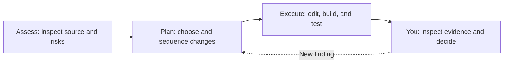

# Chapter 00: Get ready to modernize

First, run BookCatalog. Record its behavior before the agent changes it. You will compare that record with the upgraded app.

BookCatalog has one web project, one controller, an EF6 database context, and Razor views. We supply that legacy code so you can practice an upgrade rather than build an old application from scratch.

## Check before installing

Use Windows and Visual Studio 2026 for this path. BookCatalog needs the **ASP.NET and web development** workload.

The agent needs **.NET desktop development** with the **GitHub Copilot** and **GitHub Copilot app modernization** optional components. Keep compatible installations. Do not uninstall other SDKs.

In PowerShell, start in the cloned repository root:

```powershell
git --version
git config user.name
git config user.email
dotnet --list-sdks
cd shared-legacy-app
dotnet --version
sqllocaldb info
cd ..
```

| Requirement | Why you need it | Acceptable result |
| --- | --- | --- |
| Git and author identity | Save and inspect your own changes | A Git version and nonempty name/email |
| Stable .NET 10 SDK | Build the upgraded project | `dotnet --version` inside `shared-legacy-app` selects `10.0.x`, without a preview suffix |
| .NET Framework 4.8 targeting pack and SDK | Compile the original project | Visual Studio loads and builds `BookCatalog.sln` without missing-framework errors |
| ASP.NET workload and IIS Express | Build and host the legacy web app | The project loads as a web application and launches with F5 |
| SQL Server LocalDB | Store the legacy sample data | `sqllocaldb info` lists `MSSQLLocalDB` |
| Copilot component and signed-in access | Run the assessment and upgrade | The solution menu contains `Modernize`. The chat recognizes your account |

The checked-in `shared-legacy-app/global.json` allows stable .NET 10 feature bands through `latestFeature`. Run the check in that directory: SDK selection depends on the current directory, not just the project path.

<details>
<summary>Repair missing tools or access</summary>

Use the [Visual Studio Installer](https://learn.microsoft.com/visualstudio/install/modify-visual-studio) to add missing workloads and the .NET Framework 4.8 SDK/targeting pack, IIS Express, and LocalDB components. You can also use the [.NET Framework developer pack](https://learn.microsoft.com/dotnet/framework/install/guide-for-developers) and [LocalDB installation guidance](https://learn.microsoft.com/sql/database-engine/configure-windows/sql-server-express-localdb).

Install a stable [.NET 10 SDK](https://dotnet.microsoft.com/download/dotnet/10.0) only if the SDK check fails. If you already have one, inspect `global.json` and the shell's `dotnet` path before installing again.

Install [Git for Windows](https://git-scm.com/downloads/win) if needed. If author identity is missing, set it for this repository with `git config user.name "Your name"` and `git config user.email "your-address"`. Use an address you intend to appear in local commits.

Follow the [official Copilot upgrade installation instructions](https://learn.microsoft.com/dotnet/core/porting/github-copilot-upgrade/install?pivots=visualstudio). You can use paid or free Copilot access. Organizational policy and usage limits can affect availability.

</details>

## Run the original app

Open `shared-legacy-app/BookCatalog.sln` in Visual Studio. Restore NuGet packages. Select **Build > Rebuild Solution**. Resolve restore or targeting-tool errors before an assessment.

Select IIS Express. Press F5. The app should show the active book catalog. A fresh database contains six active books and one inactive book.

> **Use sample data only.** The legacy EF6 initializer can recreate its sample database if the model changes. Do not point this application at a database you care about. The later EF Core exercise uses a different database and leaves this one untouched.

Follow the [baseline behavior checks](../docs/validation.md#behavior-contract) before any code changes. Create a disposable book. Record its details URL. Use that URL to find the book after you mark it inactive.

<div class="activity">

### Checkpoint: can you explain the starting state?

In `shared-legacy-app/src/BookCatalog.Web/Controllers/BooksController.cs`, inspect `Index()`. Predict whether an inactive book appears. Predict the list order.

Check your predictions in the app. Restore your disposable record's active status.

You are ready when you can demonstrate the result, not merely identify a successful build.

</div>

## Save a baseline

Stop debugging. From the repository root in PowerShell:

```powershell
git status --short
git switch -c learn/bookcatalog-upgrade
```

If the branch name exists, use it only to resume that work. Otherwise, choose a new name. Do not reset an existing branch.

The clone's current commit is your starting checkpoint. Inspect any changes before you proceed. Keep unrelated work separate.

Later, commit only reviewed files. Keep database files and generated output out of Git.

## What the agent does



An assessment records what the agent found. Planning turns findings and your choices into tasks. Execution changes the application. Keeping these stages separate gives you a chance to correct a mistaken assumption before it becomes code.

Guided mode pauses at stage boundaries. It does not guarantee a pause or Git commit after every task.

Ask the agent to remain in Guided mode. Tell it to wait for plan approval before code changes. Check its response and selected mode.

Do not treat a bare "Continue" as a reliable review command.

The agent stores state under `.github/upgrades/{scenarioId}/`. Ask it to identify the actual folder. It contains your assessment, decisions, plan, task list, and per-task notes. These are your application's artifacts, not the repository's historical `plan.md`.

<a id="-your-first-assessment"></a>
## Optional: your first assessment

If you want a smaller warm-up, open `00-introduction/code/SimpleLegacyApp.sln` in **a separate clone**. This console app deliberately uses `HttpContext`, legacy configuration, and `BinaryFormatter`.

Open the project's context menu. Select **Modernize**. Send this request:

```text
Assess this solution for an upgrade to .NET 10 in Guided mode.
Do not plan or execute code changes yet. Identify the scenario folder
and explain one compatibility finding by pointing to its source.
```

Read the reported finding. Inspect the named source. The compatibility category does not establish whether the business can defer the change.

Use the [recorded report](../examples/assessments/README.md) for optional comparison. Do not expect identical counts. Do not copy its state into your clone.

Stop after assessment. Return to the BookCatalog clone and solution for Chapter 01. No console application output carries forward.

## Before moving on

You have a working BookCatalog baseline, a learner branch, and a behavior record. You can distinguish the agent's assessment from its plan and code changes.

**[Next: assess BookCatalog](../01-assessment/README.md)**
