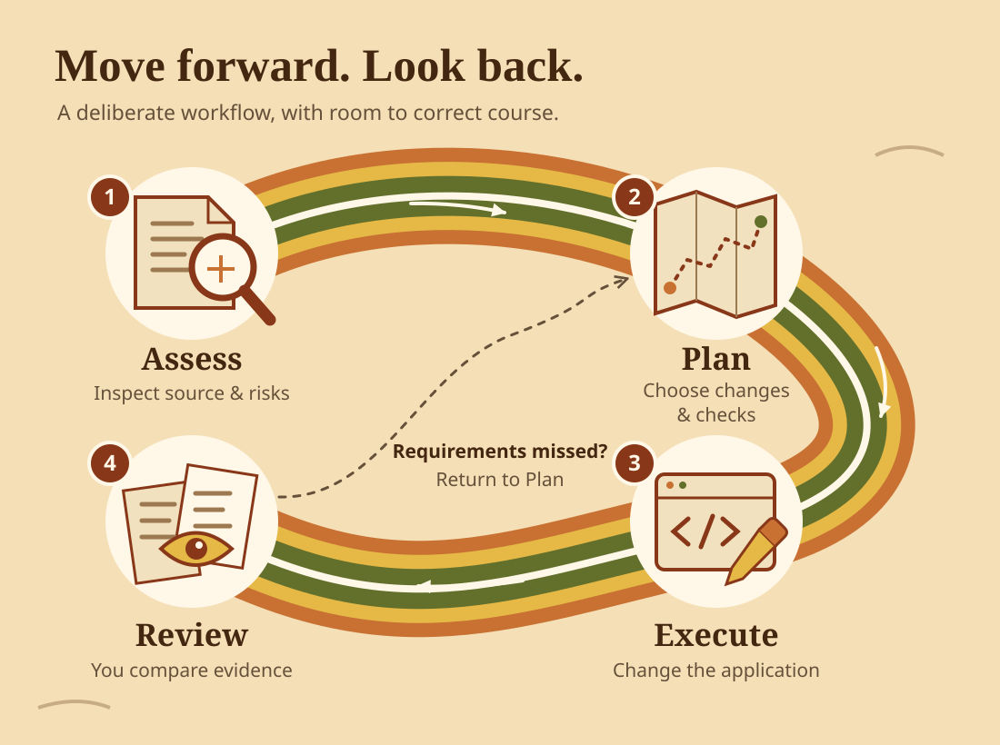

# Chapter 00: Get ready to modernize

First, run BookCatalog and record what its users can do. Then choose two records that must survive the upgrade.

We supply a legacy MVC application with one web project, one controller, an EF6 context, and Razor views. Your task is modernization, not writing a legacy app.

By the end of this chapter, you will have a working baseline, a learner branch, and the start of your [learner record](../docs/learner-record.md).

## Check before installing

Use Windows and Visual Studio 2026. The legacy web application needs the **ASP.NET and web development** workload.

The agent needs **.NET desktop development** with the **GitHub Copilot** and **GitHub Copilot app modernization** optional components.

Start in the cloned repository root in PowerShell. Run each check separately so you can identify missing tools:

```powershell
git --version
git config user.name
git config user.email
dotnet --list-sdks
Set-Location shared-legacy-app
dotnet --version
Set-Location ..
sqllocaldb info
```

| Requirement | Why you need it | Acceptable result |
| --- | --- | --- |
| Git and author identity | Inspect changes and save your own checkpoints | A Git version and nonempty name/email |
| Stable .NET 10 SDK | Build the upgraded app and run the supplied data helper | `dotnet --version` inside `shared-legacy-app` selects stable `10.0.x` |
| .NET Framework 4.8 SDK and targeting pack | Compile the original application | Visual Studio loads and rebuilds `BookCatalog.sln` without framework errors |
| ASP.NET web tools and IIS Express | Build and host the original application | Visual Studio recognizes the web project and launches it |
| SQL Server LocalDB | Store local sample records | `sqllocaldb info` lists `MSSQLLocalDB` |
| Copilot components and signed-in access | Assess and plan changes | **Modernize** appears and chat recognizes your account |

`shared-legacy-app\global.json` allows stable .NET 10 feature bands through `latestFeature`. SDK selection depends on your current directory, not only a command's project path.

A listed installation does not prove the application runs. The next section checks that separately.

<details>
<summary>Repair missing tools or access</summary>

Use the [Visual Studio Installer](https://learn.microsoft.com/visualstudio/install/modify-visual-studio) to add missing workloads or individual components.

Check the [.NET Framework developer pack](https://learn.microsoft.com/dotnet/framework/install/guide-for-developers) and [LocalDB installation guidance](https://learn.microsoft.com/sql/database-engine/configure-windows/sql-server-express-localdb) if those checks fail.

Install a stable [.NET 10 SDK](https://dotnet.microsoft.com/download/dotnet/10.0) only if needed. Keep compatible SDKs. Check `global.json` and the shell's `dotnet` path before replacing tools.

Install [Git for Windows](https://git-scm.com/downloads/win) if needed. Set missing author identity for this repository with `git config user.name "Your name"` and `git config user.email "your-address"`.

Follow the [official Copilot installation instructions](https://learn.microsoft.com/dotnet/core/porting/github-copilot-upgrade/install?pivots=visualstudio) for missing components or access. Account policy and usage limits can affect availability.

</details>

You do not need Azure CLI, Node, an Azure login, or an Azure subscription for the required course.

## Run the original app

> **Use sample data only.** The EF6 initializer can recreate its sample database after model changes. Never point this app at a business database.

1. Open `shared-legacy-app\BookCatalog.sln` in Visual Studio.
2. Restore NuGet packages.
3. Select **Build > Rebuild Solution**.
4. Resolve restore and targeting-tool errors before continuing.
5. Select IIS Express.
6. Press F5.

The active catalog should load. A fresh database contains six active seed books and one inactive Matrix record. Existing lab data can change the count.

Application startup creates `App_Data` before EF initializes the database. You do not need to create that directory or an empty MDF.

Inspect `Controllers\BooksController.cs` inside the web project. Predict which records `Index()` includes and how it sorts them.

Check your prediction in the app. Inspect `Models\ApplicationDbContext.cs` to find the inactive seed record and its details route.

The inactive record is absent from the list, but its details route still works. Inactive does not mean deleted.

If startup fails, record the error and check the LocalDB instance and connection configuration. Do not create an empty MDF or delete a database as a shortcut.

## Choose the records that must survive

Open the [learner record](../docs/learner-record.md). Copy its template into your own local notes. Keep the same notes throughout the course.

Create these **two carry-forward records** through the app:

| Field | Active record | Inactive record |
| --- | --- | --- |
| Title | `Aster field notes` | `Dormant atlas` |
| Author | `Rowan Example` | `Mira Sample` |
| ISBN | `9780000000001` | Leave blank |
| Published Year | `2024` | Leave blank |
| Active | Selected | Cleared |

These are sample values, not required IDs. Record each assigned ID from its details URL. Do not assume the IDs are `8` and `9`.

Use the active record's details link. For the inactive record, use the ID shown in Visual Studio's SQL Server Object Explorer.

Connect Object Explorer to `(localdb)\MSSQLLocalDB`. Select the database used by this app's `Web.config`. Open `dbo.Books` to identify your record.

Then open `/Books/Details/<actual-id>` on the app's local address. Replace `<actual-id>` with the value you found.

Keep both records unchanged for the rest of the course. Do not edit, deactivate, or delete them as a behavior experiment.

The blank fields let you check SQL `NULL` preservation later. A blank screen field alone does not prove how the database stores it.

The details view shows only the date part of `CreatedDate`. Chapter 02 exports the stored value for a full-precision comparison.

## Check behavior with a separate record

Create a third, **throwaway record**. Record its details URL before testing inactive status.

Use it for creation, editing, validation, and deletion checks in the [baseline checklist](../docs/learner-record.md#behavior-checks).

Restart the app before deleting it. Confirm that its saved values remain. Confirm that both carry-forward records also remain.

Check server responses separately from browser validation. Compare a throwaway record's stored creation time before and after editing.

<details>
<summary>How to check the server and stored creation time</summary>

Open the throwaway record's Edit form. In browser developer tools, open **Network** before testing so you can observe the request.

In the **Elements** panel, set `novalidate` on that form. This disables native browser validation, not JavaScript validation.

For the overlong-title case, temporarily remove the title input's `maxlength` attribute. Otherwise, the browser can prevent you from entering the test value.

Enter one invalid value at a time and keep the other required fields valid. Keep the hidden antiforgery token unchanged.

Submit the form. Inspect **Network** for an actual POST, then inspect its response and the stored record.

If JavaScript still intercepts submission, use the native form submission below.

It selects the page's first form. Confirm that this is your throwaway Edit form before running it.

If not, replace `'form'` with a selector for the test form. Then run the command in the browser console:

```javascript
HTMLFormElement.prototype.submit.call(document.querySelector('form'))
```

The call bypasses submit handlers while retaining the form's fields and token.

An on-screen warning without a POST tests only client validation. The server must reject invalid values without changing the stored row.

Reload the page after each case to restore attributes, values, and normal submission behavior. Do not disable validation in application code.

For an antiforgery check, load a fresh throwaway form with valid field values. Remove its hidden `__RequestVerificationToken` in developer tools.

Submit it and confirm an actual POST was rejected without a write. Reload afterward. Do not disable antiforgery in application code.

Use SQL Server Object Explorer to compare stored creation time. Select this app's database and replace `<throwaway-id>` in this read-only query:

```sql
SELECT Id, CONVERT(nvarchar(27), CreatedDate, 126) AS StoredCreatedDate
FROM dbo.Books
WHERE Id = <throwaway-id>;
```

Run it before and after an edit. Compare the stored values, not only the date displayed by the view.

</details>

Do not change source code to set up this baseline.

<div class="activity">

<a id="checkpoint-can-you-explain-the-starting-state"></a>
### Checkpoint: what would a build miss?

Explain why a successful build cannot prove active filtering or persistence.

Show your two selected IDs. Explain why the throwaway record must be different.

</div>

## Save a baseline

Stop debugging. From the repository root:

```powershell
git status --short
git switch -c learn/bookcatalog-upgrade
if ($LASTEXITCODE -ne 0) { throw "Inspect the branch error before continuing." }
```

If the branch already exists, resume it only if it contains this work. Otherwise, choose a new name. Do not reset an existing branch.

Record the baseline commit with `git rev-parse HEAD`. Inspect any pending changes and keep unrelated work separate.

Later, commit only reviewed files. Keep database files, local snapshots, and credentials out of Git.

## What the agent does



An assessment describes the starting point. A plan chooses the work. Execution changes the application. Your checks establish what actually works.

Ask for Guided mode and approval before code changes. Confirm the agent's response. Guided mode does not guarantee every requested task-level pause.

Upgrade state normally lives under `.github\upgrades\{scenarioId}`. Ask the agent to identify its actual files.

Do not require a task file before the agent creates it. Chapter 02 explains editable requirements and agent-updated progress.

The repository's historical `plan.md` is not your scenario plan.

<a id="-your-first-assessment"></a>
## Optional: your first assessment

For a smaller warm-up, open `00-introduction\code\SimpleLegacyApp.sln` in **a separate clone**. It deliberately uses `HttpContext`, legacy configuration, and `BinaryFormatter`.

Open its context menu and select **Modernize**. Send:

```text
Assess this solution for an upgrade to .NET 10 in Guided mode.
Do not plan or execute code changes yet.
Identify the scenario folder.
Explain one compatibility finding by pointing to its source.
```

Inspect the named source. A compatibility category does not decide whether a business can defer that change.

The [recorded report](../examples/assessments/README.md) is an optional comparison. Do not copy its historical state into your live scenario.

Stop after assessment. Return to the BookCatalog clone and solution. No console output carries forward.

## Before moving on

You have a working BookCatalog baseline, a learner branch, and observed behavior checks.

Your notes identify one active and one inactive carry-forward record. A different record handled the destructive tests.

**[Next: assess BookCatalog](../01-assessment/README.md)**
