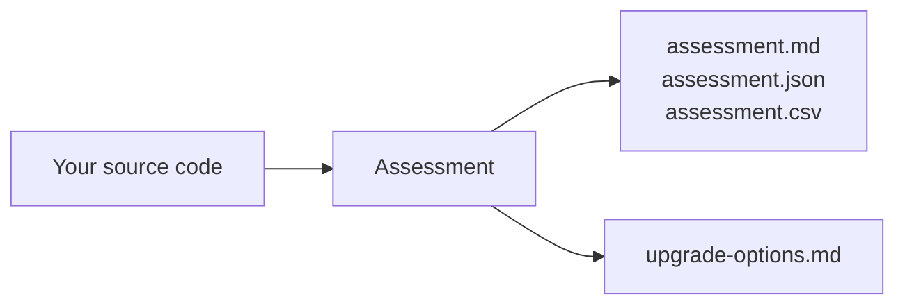

# 00 · Set up and first run

By the end of this chapter you'll have run GitHub Copilot modernization against a real
ASP.NET MVC 5 application and read the assessment it produced.

**Time: ~30 minutes** · **You need:** Visual Studio on Windows, a GitHub account with
Copilot access

## What you'll do

- Confirm your machine has what the agent needs
- Get the legacy app building and running
- Start the agent and ask it to upgrade to .NET 10
- Stop at the end of assessment and read the report

## Before you start

### Check your setup

| You need | Version | How to check |
|---|---|---|
| Windows | Any release your Visual Studio supports | `winver` |
| Visual Studio | 2026, or 2022 version 17.14.17 or later | **Help → About Microsoft Visual Studio** |
| Workload | .NET desktop development | Visual Studio Installer → **Modify** |
| Components | GitHub Copilot **and** GitHub Copilot app modernization | Right-click any project — **Modernize** should appear |
| Copilot subscription | Free works in VS 2026 18.1+; otherwise Pro, Pro+, Business, or Enterprise | The signed-in account in Visual Studio |
| Legacy build | .NET Framework 4.8 Developer Pack, IIS Express, SQL Server Express LocalDB | `msbuild -version`, `sqllocaldb info` |
| Modern target | .NET 10 SDK | `dotnet --list-sdks` |
| Git | Any current version | `git --version` |

Full details, including the Azure requirements you'll need later, are in
[what you need to run this](../docs/ENVIRONMENT.md).

Run the preflight script from the repository root:

```powershell
.\scripts\Test-Prerequisites.ps1
```

The agent needs a local Git repository. Without one it can't create branches or commits,
which are your undo button for everything that follows.
{: .warning }

### Get a green baseline

Copy the legacy app into a working folder and prove it builds and runs:

```powershell
.\scripts\Reset-Course.ps1 -Checkpoint legacy-baseline
Set-Location .\work
nuget restore .\BookCatalog.sln
msbuild .\BookCatalog.sln /p:Configuration=Release
```

You should see **Build succeeded**. Now press <kbd>F5</kbd> in Visual Studio, browse to
`/Books`, and confirm the list loads with seed data. Create a book, edit it, delete it.

That's your baseline: it compiles, it runs, and CRUD works.

This matters more than it looks. Microsoft's guidance is blunt about it: verify your
solution builds and works before you start. If the solution is already broken, the agent
can't tell your pre-existing failures apart from problems it introduced — and neither
can you.

### There are no tests, and that is the point

BookCatalog ships with zero automated tests, which makes it exactly like most of the
legacy code you'll be asked to modernize.

This is worth sitting with, because it shapes everything that follows. **The agent runs
whatever tests you already have. It will not write them for you.** Nothing in the
modernization tooling generates a test suite. So on an untested codebase, every claim of
"the upgrade worked" rests on somebody manually clicking through the app.

You have two honest options:

1. **Validate by hand** — build, run, click through the behavior you care about. This is
   what the course does by default, and it's what you'll do in Chapter 03.
2. **Write characterization tests first** — capture today's behavior in code, then let the
   agent run them after every task. Slower to start, dramatically safer.

Option 2 is the professional answer, and Chapter 03 has an exercise that walks you through
it. For now, know why the gap exists. More in
[proving behavior didn't change](../docs/VALIDATION.md).

### Meet the app

`BookCatalog` is small but realistic — a single ASP.NET MVC 5 project:

- `BookCatalog.Web` — ASP.NET MVC 5, Entity Framework 6, `System.Web`, LocalDB
- Models, controllers, and views all live in that one project
- Packages come from `packages.config`, not `PackageReference`

One project sounds easy. It isn't. Everything is coupled to `System.Web`, the package
format predates SDK-style projects, and EF6's initializer runs on app start. A monolith
gives the agent a *sequencing* problem inside a single project instead of across several
— which is exactly what you'll review in Chapter 02.

## Steps

### 1. Open the solution and start the agent

Open `work\BookCatalog.sln` in Visual Studio.

Right-click the solution in Solution Explorer and choose **Modernize**. You can also open
GitHub Copilot Chat and type `@Modernize`.


### 2. Tell it what you want

```text
Upgrade my solution to .NET 10
```

### 3. Answer the setup questions

Before analyzing anything, the agent collects a few decisions. This step is
**pre-initialization**:

- **Target framework** — .NET 10
- **Branch strategy** — let it create a branch, and let it commit after each task
- **Flow mode** — choose **Guided**

Pick **Guided**. It stops at each stage boundary and asks before continuing, which
Microsoft recommends for first-time users and for anyone who wants to learn the process.
That's you, right now.

The alternative, **Automatic**, runs straight through without pausing. You can switch
between them at any point by typing `pause` or `continue`.

### 4. Let assessment run, then stop

The agent analyzes your project dependency graph, NuGet package compatibility, breaking
API changes, and test coverage.

When it finishes it pauses and asks whether to continue — something like *"Here's what I
found. Shall I proceed with upgrade options?"*

**Say no.** Don't continue into planning yet. That's Chapter 02.


### 5. Find and read the report

The agent wrote its state into your repository. Look for:

```text
.github/upgrades/scenarios/dotnet-version-upgrade/
├── assessment.md      ← the human-readable report; start here
├── assessment.json    ← the same findings, structured
├── assessment.csv     ← one row per incident, with file and line number
└── scenario.json      ← which scenario ran, when, and against what target
```

`dotnet-version-upgrade` is the scenario the agent selected for a .NET version upgrade.
A different scenario writes a different folder name, so open
`.github/upgrades/scenarios/` and confirm what yours is actually called.
{: .note }

Open `assessment.md` and read it. Don't act on it yet. You're looking for shape: what
sections exist, what it found, what it thinks is hard.

`assessment.csv` is the one people miss. It's every finding as a flat row — issue ID,
severity, story points, file, line, and the offending snippet. When you want to sort by
severity or count how many times one API shows up, open the CSV, not the Markdown.
{: .tip }

If your machine is slow or your solution is large, this can take several minutes. Watch
progress in **View → Output → AppModernizationExtension**.

## What just happened

You ran the first of three stages.

Diagram: assessment reads your code and writes findings, but changes no source.



**Assessment reads. It does not write code.** That separation is the entire reason the
stages exist. You get a complete picture of what the upgrade involves *before* a single
line of your application changes — which makes right now the cheapest possible moment to
disagree with the agent.

Everything the agent knows lives under `.github/upgrades/scenarios/{scenarioId}/`. Those
files are ordinary Markdown, JSON, and CSV, they sit in your repository, and you can edit
them. That's how you steer this thing, and it's what the next four chapters are about.

Commit that folder along with your branch. It's the agent's memory and your audit trail.
{: .tip }

## Try changing it

Ask the agent about its own reasoning:

```text
What scenarios are available for my solution?
```

The agent matches your code against dozens of built-in scenarios and ranks them. Seeing
what it *didn't* pick tells you as much as seeing what it did.

## If something goes wrong

| Problem | What to do |
|---|---|
| **Modernize** isn't on the right-click menu | Visual Studio Installer → **Modify** → confirm both **GitHub Copilot** and **GitHub Copilot app modernization** components are checked |
| The build fails before you start | Stop and fix the baseline. The agent can't distinguish your failures from its own |
| NuGet restore fails | If you use a private feed, authenticate before starting the agent |
| The agent can't create a branch | Confirm you're inside a Git repository with a clean working tree |

More failure modes are in [troubleshooting](../docs/TROUBLESHOOTING.md).

## Check yourself

1. Why does the agent need a working baseline *before* it starts?
2. What did assessment change in your application source code?
3. BookCatalog has no tests. What will you use as evidence that the upgrade preserved
   behavior?

---

Next → [Chapter 01: Assessment](../01-assessment/README.md)
