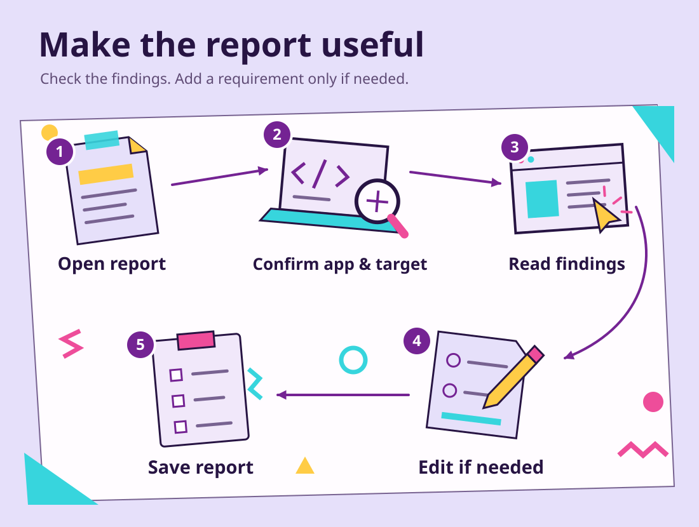

# Chapter 01: Assess BookCatalog

An assessment identifies what must change before an app can use your selected .NET version.
The modernization agent generates the report through GitHub Copilot in Visual Studio.

We'll use `shared-legacy-app\BookCatalog.sln` inside your learner copy.
It's the same solution you ran in Setup. Open it in Visual Studio and stop debugging.

## Why assess the app?

The report gives you a starting point for the upgrade. It identifies incompatible APIs, project changes, and package issues.
You can share the report with your team or management when discussing the work.
The modernization agent also uses it to prepare the upgrade plan.

## Ask for an assessment

Open **GitHub Copilot Chat**. Sending `@Modernize` opens the **Upgrade Agent Dashboard**.
In the recorded run, chat offered **@Modernize Run an assessment for BookCatalog**.

Instead of selecting that short suggestion, send the full request below.
The extra context tells the agent which project to assess and when to stop.

```text
@Modernize Assess BookCatalog from .NET Framework 4.8 to .NET 10 in Guided mode.
Assess only shared-legacy-app\BookCatalog.sln and its BookCatalog.Web project.
Exclude the data helper, completed reference, test projects, and course website.
Write the assessment and identify its scenario folder.
Do not change application code, execute the upgrade, or create Git commits.
Stop when the assessment is ready for review.
```

**Guided mode** lets you review the assessment and plan before approving implementation.
The agent may ask permission to inspect Git information or run the assessment.
Approve those requests for this learner copy. Don't approve a commit or application upgrade during this step.

Visual Studio opened the report automatically in the recorded run. The dashboard also changed to show the assessment.
If your report doesn't open, select the assessment in the dashboard.
Ask the agent for the report's path if you can't find it.

The usual location is `.github\upgrades\<scenarioId>\assessment.md`.
The agent chooses `<scenarioId>`.
Use the directory it reports, not a directory you create yourself.
See the [recorded BookCatalog example](../examples/assessments/bookcatalog/README.md) for actual output.


[Open the full-size dashboard screenshot](../examples/assessments/bookcatalog/images/ch1-2-dashboard-assessment.png).

## Read the report in a useful order

<a id="separate-compatibility-from-priority"></a>
<a id="trace-a-finding-into-the-application"></a>
<a id="your-decision-can-this-finding-wait"></a>

The supplied BookCatalog assessment has these sections:

| Report section | What to check |
| --- | --- |
| **Executive Summary** | One BookCatalog web project, moving from `net48` to `net10.0` |
| **Projects Compatibility** | The `BookCatalog.Web.csproj` row describes a classic project that needs conversion |
| **Top API Migration Challenges** | The `System.Web` findings identify MVC 5 APIs that need ASP.NET Core replacements |
| **Project Details** | The file, API, and binding-redirect entries show where the agent found the work |

The recorded report lists **89 incompatible API findings** and **three binding redirect issues**.
Those counts describe that run, not a required result for yours.
A binding redirect tells .NET Framework which assembly version to load.
ASP.NET Core handles dependencies differently.

The report also lists zero packages in its aggregate table, but seven package issues in the project row.
Don't read the zero as proof that there are no package changes.
Open `shared-legacy-app\src\BookCatalog.Web\packages.config` to see the legacy package list.
Ask the agent to explain any mismatch before you approve its package choices.
In the supplied follow-up, the agent counted six actual packages.

The [recorded assessment excerpts](../examples/assessments/bookcatalog/assessment-excerpts.md) include the original counts and package findings.
The supplied detailed report screenshot also has stale **.NET 8** labels.
Check the target in your saved assessment rather than copying a screenshot label.

<a id="what-the-numbers-do-not-prove"></a>
Issue counts aren't an estimate of upgrade time.
Read the affected code and proposed change, not only the severity icon.

## Add a preference Copilot can use

<a id="tell-the-agent-what-must-survive"></a>
An assessment doesn't need an edit just to complete this lesson.
Keep it unchanged if it describes the right app and target.
If you want to add a requirement, either edit the report or ask the agent to add it.

For example, open the generated `assessment.md` and add:

```text
## Application requirements

Keep the current book-list page and forms.
Upgrade the framework without redesigning the interface.
```

Save the file. Then send this in the same chat:

```text
@Modernize Read the Application requirements section in this scenario's assessment.md.
Keep that requirement in the assessment and use it when you create the plan.
Do not change application code or execute the upgrade yet.
```

To have the agent make the edit instead, send this request rather than editing the file yourself:

```text
@Modernize Add an Application requirements section to this scenario's assessment.md.
Add: Keep the current book-list page and forms. Do not redesign the interface.
Use that requirement when you create the plan.
Do not change application code or execute the upgrade yet.
```

Check the saved `assessment.md` after either method.
If you made no changes, move directly to the next section.



## Save the assessment for planning

Keep the generated report and scenario files in your learner copy.
They record the starting findings for the plan and for later discussions with your team or management.
If you changed the report, keep the explanation of your change with it.

In Visual Studio, open **View > Git Changes**.
Expect assessment and scenario files, not converted application files.
The next chapter starts from this assessment in the same modernization chat.

## If the assessment differs or fails

For a restore error, restore packages and rebuild `BookCatalog.sln`, then ask the agent to retry the assessment.
For the wrong application or target, correct those details in chat and regenerate the report before planning.

If chat loses the scenario, send:

```text
@Modernize Find the existing BookCatalog .NET 10 assessment in this learner copy.
Show its scenario folder and assessment.md path.
Continue with that scenario. Do not create a second assessment.
```

**[Next: shape the upgrade plan](../02-planning/README.md)**

## Reference

- [Visual Studio upgrade walkthrough](https://learn.microsoft.com/dotnet/core/porting/github-copilot-upgrade/how-to-upgrade-with-github-copilot?pivots=visualstudio)
- [Upgrade concepts and flow modes](https://learn.microsoft.com/dotnet/core/porting/github-copilot-upgrade/concepts)
- [Historical console assessment](../examples/assessments/README.md)
