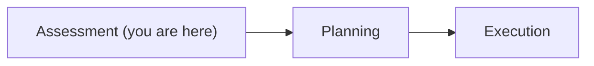
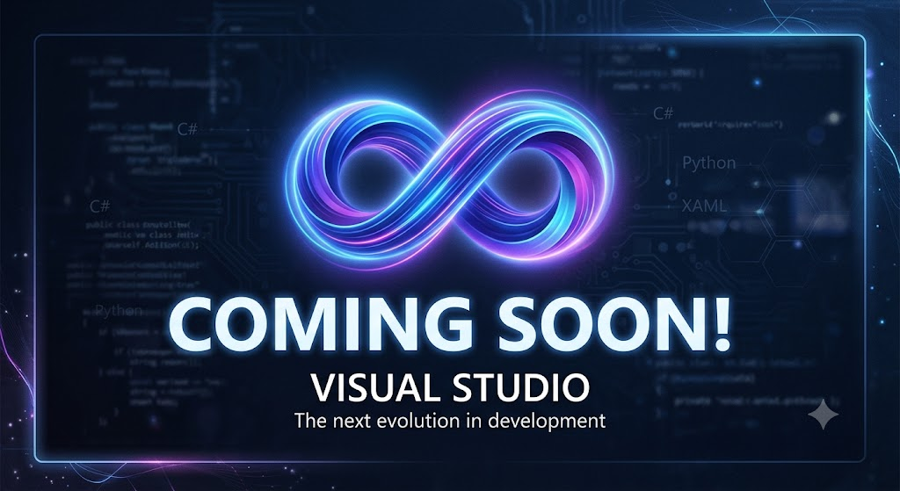

# 01 · Assessment

By the end of this chapter you'll be able to read an assessment report critically, spot
what the agent got wrong, and correct it before it makes a single plan.

**Time: ~45 minutes** · **You need:** the `assessment.md` you generated in Chapter 00

## What you'll do

- Walk through every section of a real assessment report
- Separate three things beginners collapse into one: compatibility, severity, priority
- Add context the agent can't discover from your code
- Choose an upgrade strategy and understand what it costs you

Diagram: you are at stage one of three.



## Before you start

You need an `assessment.md` under `.github/upgrades/scenarios/{scenarioId}/`. If you don't have one,
go back to [Chapter 00](../00-setup/README.md) or jump to the checkpoint:

```powershell
.\scripts\Reset-Course.ps1 -Checkpoint 01-assessment
```

## Steps

### 1. Read the report top to bottom

Open `assessment.md`. A real report has this shape:

| Section | What it tells you |
|---|---|
| Executive Summary → Highlevel Metrics | Project count, package count, lines of code, issue count, and an **estimated LOC to modify** |
| Executive Summary → Projects Compatibility | Per-project target framework, a difficulty rating, and issue counts split into package vs. API |
| Executive Summary → Package Compatibility | Every NuGet package bucketed as compatible, incompatible, or upgrade-recommended |
| Executive Summary → API Compatibility | Every API you call, bucketed as binary incompatible, source incompatible, behavioral change, or compatible |
| Aggregate NuGet packages details | Current version and suggested version, package by package |
| Top API Migration Challenges | The technologies costing you the most, each with a written migration path |
| Projects Relationship Graph | A Mermaid diagram of what depends on what |
| Project Details | The whole thing again, per project |

Learn the vocabulary now, because the agent uses it consistently:

- **Binary incompatible** — the API is gone. Code changes required.
- **Source incompatible** — it exists but the call site must change and be recompiled.
- **Behavioral change** — it compiles and runs, but does something different. These are the
  dangerous ones, because nothing fails loudly.
- **Story points** — the agent's effort estimate per issue. Useful for sequencing, not for
  promising a delivery date.

Your report will not look exactly like anyone else's. Section names and ordering change
between tool versions, and content changes with your code. See
[when your output differs](../docs/OUTPUT-DIFFERS.md).
{: .note }



Now open `assessment.csv` in the same folder. Same findings, one row per incident, with
`Severity`, `Story Points`, `Path`, `Line`, and the offending `Snippet`. Sort by severity
and you have a work queue. Filter by `Incident ID` and you can count how many times a
single API bites you. The Markdown is for reading; the CSV is for deciding.

### 2. Separate compatibility, severity, and priority

This is the single most useful habit in the whole course, and the agent will not do it
for you.

- **Compatibility** is a fact about the package or API. Does a .NET 10 version exist? Yes
  or no. The agent determines this reliably.
- **Severity** is about *your* application. `System.Web.HttpContext` is incompatible for
  everyone, but if you touch it in one helper method it's a small job and if it's threaded
  through 40 controllers it isn't.
- **Priority** is about your calendar. A high-severity item on a feature you're deleting
  next quarter is not urgent. A low-severity item blocking every other task is.

The agent knows compatibility. It can estimate severity — that's what `Mandatory`,
`Potential`, and story points are. **It cannot know priority** — that's yours, and it's
the main thing you're adding in this chapter.

Work through the report with the
[assessment worksheet](../templates/assessment-worksheet.md). One row per finding, one
column each for those three ideas.

### 3. Look at what BookCatalog actually surfaces

Expect the assessment to flag roughly these, in some form:

| Finding | Compatibility | Why it matters |
|---|---|---|
| `System.Web` / `HttpContext.Current` | Not available on .NET 10 | ASP.NET MVC 5 is built on it. This is the structural work |
| Entity Framework 6 | EF6 runs on modern .NET, but EF Core is the forward path | A real decision, not a mechanical swap |
| `packages.config` | Superseded by `PackageReference` | Mechanical, but must happen before much else |
| `Web.config` / `ConfigurationManager` | Replaced by `appsettings.json` plus the options pattern | Configuration and DI change together |
| ASP.NET MVC 5 → ASP.NET Core MVC | Different framework, similar shape | Most of the visible churn |

Notice the pattern: two of these are mechanical, three involve a judgment call. That ratio
is normal, and it's why review exists.

Also notice what the report *doesn't* say. There's no row for "this app has no tests."
Compatibility analysis is static — it reads your code, not your confidence. The biggest
risk in this upgrade is invisible to the tool that just scanned it.
{: .warning }

### 4. Correct the assessment

`assessment.md` is **editable**, and editing it is the supported way to give the agent
context it cannot find in your source. It has no idea that:

- A project is scheduled for deletion
- A package is pinned because of a vendor contract
- A "test" project has no real coverage
- A controller is dead code behind a feature flag

Add a section and say so plainly:

```markdown
## Context from the team

- Views/Books/Delete.cshtml is reached only by admins. Behavior there is lower risk than
  the Index and Create paths, which every user hits.
- There are no automated tests. Treat every task's validation step as manual until I say
  otherwise, and never mark a task done on "it compiles" alone.
```

Then tell the agent to reread it:

```text
I've updated assessment.md with additional context. Please review it before we plan.
```

Edit the report, don't argue with the chat transcript. Chat scrolls away; the file
persists and gets loaded again next session.
{: .tip }

### 5. Choose an upgrade strategy

At the end of assessment the agent recommends a strategy. There are three, and they are
the product's own vocabulary — not something this course invented.

| Strategy | What it does | Choose it when |
|---|---|---|
| **Bottom-up** | Upgrade leaf dependencies first, work up toward the entry point | The default. Each step compiles against already-upgraded code |
| **Top-down** | Start at the entry point and work down | You need the app runnable early, and you'll tolerate stubs |
| **All-at-once** | Change everything, then fix the fallout | Small solutions, or a codebase too tangled to slice |

BookCatalog is a single project, so all three collapse to the same thing. That's worth
noticing rather than skipping: **the strategy question is about ordering projects, and a
monolith has no project ordering to argue about.**

Which does not mean sequencing stops mattering. It means the sequencing problem moves
*inside* the project, where the agent has to decide whether `packages.config` migration
comes before or after the `System.Web` work, and whether views move before or after
controllers. Chapter 02 is where you'll see those choices and change them.

You can still state the strategy explicitly, and you should — it's recorded as a decision:

```text
Use an all-at-once strategy. It's one project, so sequence the work inside it:
package format first, then configuration, then System.Web.
```

The agent records your confirmed decisions in `upgrade-options.md` alongside the
assessment. Read that file — it's the contract the plan gets built from.

## What just happened

You did the thing that makes assessment worth running as its own stage: you **disagreed
with a machine before it acted**.

Assessment produced facts. You supplied judgment — which findings matter, which are noise,
what the agent can't see, and what order to work in. None of that costs anything to change
right now. All of it gets expensive once code starts moving.

## Try changing it

Push on the report and watch it respond:

```text
Re-analyze package compatibility only. I want to see whether any of these have prerelease
.NET 10 versions.
```

```text
What would change if I targeted .NET 8 instead of .NET 10?
```

Compare the answers against the original report. You're building an instinct for what the
agent is confident about versus what it's estimating.

## If something goes wrong

| Problem | What to do |
|---|---|
| Assessment finds nothing interesting | Confirm you pointed it at the solution, not a single project |
| A package shows as incompatible but you know it works | Add that to your context section and say why |
| The report is enormous | Start with Top API Migration Challenges and the relationship graph. Skip the exhaustive package table on a first pass |
| The agent ignored your edits | Confirm you saved the file, then explicitly tell it to reread `assessment.md` |

## Check yourself

1. Name a finding that's fully incompatible but low priority for your app, and say why.
2. Where does the agent record the strategy you chose?
3. What can you tell the agent in `assessment.md` that it could never learn from your code?

---

Next → [Chapter 02: Planning](../02-planning/README.md)
