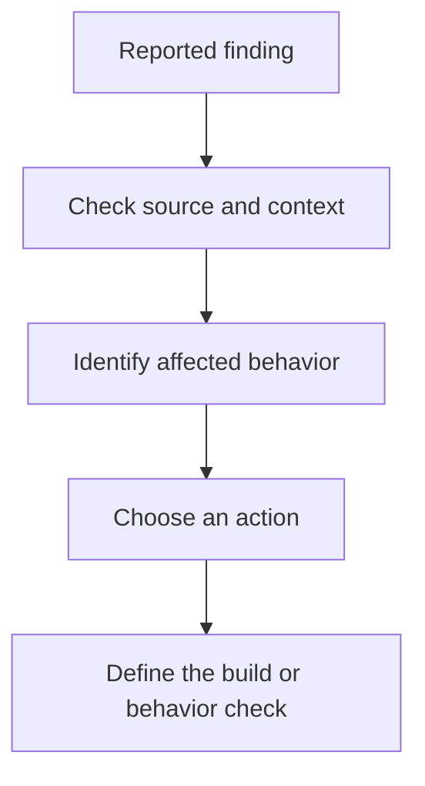

# Chapter 01: Assess BookCatalog

An assessment describes the application before you change it. You will use that description to choose work, not to estimate effort from a count.

Start with the working legacy app and learner branch from [Chapter 00](../00-introduction/README.md). Keep your [behavior record](../docs/validation.md#behavior-contract) available. Do not edit application code in this chapter.

## Ask for an assessment

Open `shared-legacy-app/BookCatalog.sln` in Visual Studio. Stop debugging before the assessment.

Select **Modernize** from the solution's context menu. Select the .NET upgrade option if the agent asks which operation you want.

Send this request:

```text
Assess BookCatalog for an upgrade from .NET Framework 4.8 to .NET 10.
Stay in Guided mode. Use my current learner branch.
Do not change application code or execute an upgrade plan.
Identify the scenario folder. Explain each major compatibility risk.
Include our baseline behavior checks in your assessment.
```

Inspect each requested permission before you approve it. Check the directory and command scope. Stop if the request targets another repository or database.

Open the assessment file through the agent. Its location follows `.github/upgrades/{scenarioId}/assessment.md`. Check the solution name and target framework.


The image records one run. Your report can contain different findings, sections, or package versions. Those differences do not by themselves indicate a failure.

## Read the report in a useful order

| Section or equivalent | What to inspect | What it can tell you |
| --- | --- | --- |
| Project summary | Source framework, target, project type, dependencies | Which application the agent assessed |
| Package findings | Current packages and proposed replacements | Which dependencies need an upgrade, replacement, or removal |
| API findings | Named APIs and source locations | Where source or runtime behavior needs attention |
| Technology groups | MVC, configuration, EF6, and startup | Which findings share an underlying change |
| Test coverage and risks | Existing tests and untested behavior | Which conclusions still need evidence |

BookCatalog has one production project. Its classic web project format and `System.Web` dependencies mean this upgrade needs more than a target-framework edit.

Package rows need interpretation. ASP.NET Core provides web framework features through its framework reference. Removing an MVC 5 package still requires compatible controllers and views.

## Separate compatibility from priority

Compatibility categories describe a kind of change. They do not establish the business priority.

| Compatibility category | Meaning | Evidence to seek |
| --- | --- | --- |
| Binary incompatibility | An existing compiled component can stop working with the new dependency or runtime | Check replacements and rebuild affected components |
| Source incompatibility | Existing source can need edits before it compiles against the new API | Inspect the reported source and compile the changed code |
| Behavioral change | Code can compile but produce a different result | Test the affected behavior |

A source incompatibility can block the build. A behavioral change can damage data. Neither category automatically means "optional."

For each important finding, record three separate decisions:

1. What technical change does the finding describe?
2. How important is the affected behavior to the application's user?
3. Will you fix, replace, remove, or explicitly defer that behavior?

Low business priority does not make incompatible code compile. Deferral needs a workable design, such as keeping a feature in a separate compatible application.



## Trace a finding into the application

Open `shared-legacy-app/src/BookCatalog.Web/Controllers/BooksController.cs`.

`Details(int id)` calls `HttpNotFound()` when a book does not exist. The important behavior is an HTTP 404 response. A replacement must preserve that response.

`Index()` reads the request's user-agent value. In a controller, ASP.NET Core provides the current request through `Request`. This does not require a separate context accessor.

Now inspect `Global.asax.cs`. Its startup method configures routes, filters, and database initialization. These responsibilities need locations in the new application's startup code.

<div class="activity">

### Your decision: can this finding wait?

Choose a finding in `BooksController.cs`. Record its source location, affected behavior, proposed action, and a check.

Suppose the affected page has few users. Decide whether that fact changes the compatibility problem or only its business priority.

</div>

<details>
<summary>Compare your reasoning</summary>

The page still belongs to the same compiled application. Its user count does not change the API requirements.

For `HttpNotFound()`, a reasonable replacement is ASP.NET Core's `NotFound()`. Check a missing record's route for HTTP 404 after the change.

For the active list, check both filtering and title order. A successful build cannot establish either behavior.

</details>

## What the numbers do not prove

An API count can identify repeated patterns. It does not measure the time required to redesign startup or test data behavior.

An estimated line count does not include every review, environment repair, or test. Do not turn it into a promised schedule.

No reported behavioral issues means the assessment found none. It does not mean the application will behave identically after the upgrade.

## Save the assessment for planning

Ask the agent to correct inaccurate facts before planning. Keep technical categories separate from your priority notes.

Check the pending diff. It should contain assessment and scenario information, not application edits.

From the repository root in PowerShell:

```powershell
git status --short
git diff
git add .github/upgrades
git diff --cached
git commit -m "Record BookCatalog assessment"
```

Run the commit command only after you inspect the staged files. If the agent uses another directory, use that directory instead.

You are ready when your report identifies BookCatalog and your finding/action record includes checks for the affected behaviors.

## If the assessment differs or fails

For restore errors, restore packages and rebuild the legacy solution first. For an incorrect project name, stop and reopen the correct solution.

For an unexpected finding, inspect its source location. Tell the agent what evidence contradicts the finding. Do not edit report categories merely to reduce a count.

For an expired chat, reopen the solution. Ask the agent to identify the existing scenario before it starts another assessment.

**[Next: choose an upgrade plan](../02-planning/README.md)**

## Reference

- [Upgrade concepts and state](https://learn.microsoft.com/dotnet/core/porting/github-copilot-upgrade/concepts)
- [Types of breaking changes](https://learn.microsoft.com/dotnet/core/compatibility/categories)
- [ASP.NET Framework migration](https://learn.microsoft.com/aspnet/core/migration/fx-to-core/)
- [Historical console assessment](../examples/assessments/README.md)
