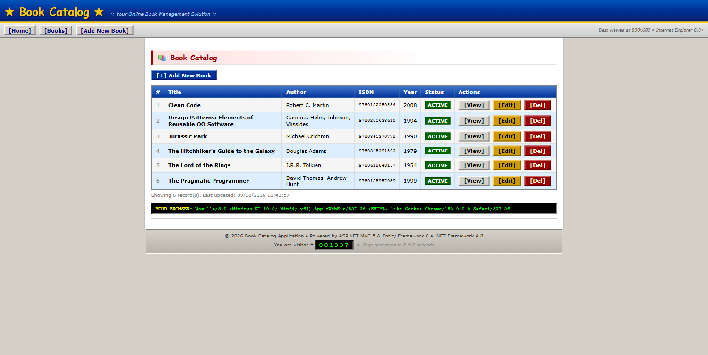

# Chapter 02: Meet BookCatalog and the tools

BookCatalog is a small .NET Framework 4.8 web app for keeping track of books.
A catalog editor can add a book, edit its details, and browse the catalog.

It works. The page even recommends Internet Explorer 6.

You'll use the modernization agent through GitHub Copilot in Visual Studio to upgrade this app to .NET 10.
Then you'll use the Azure modernization workflow to plan its move to Azure.

We supply the application so you can focus on the tools. Its code lives in one web project, `BookCatalog.Web`.

The app uses ASP.NET MVC 5 to handle web requests.
Its Razor views combine C# and HTML to produce pages.
Entity Framework 6 (EF6) is the library that reads and saves book records.

When you open the catalog, `BooksController` asks `ApplicationDbContext` for the active books.
That context gives the controller access to the database through EF6.
A Razor view turns those books into the page you see.
The `Book` class in `Models\Book.cs` defines each record's fields, such as its title, author, and active status.

## What the agent does

**GitHub Copilot upgrade** provides the framework-upgrade workflow.
You send requests in Copilot Chat.
An **assessment** is a report of what needs to change. A **plan** puts those changes in order.
The modernization agent writes both, then changes the application after your approval.

You can edit the saved reports and plans or ask the agent to update them.
You can also keep an assessment unchanged when its findings are correct.

The destination is **ASP.NET Core MVC, Entity Framework Core (EF Core), and .NET 10**.
ASP.NET Core MVC replaces the old web framework. EF Core replaces EF6 for database access.
These replacements need code changes, not only a new version number in the project file.
You'll review those changes and run your upgraded app in Visual Studio.

**GitHub Copilot modernization** also provides the later **Migrate to Azure** workflow. You'll finish with an Azure assessment and migration plan.

## What carries forward

You'll work on one learner copy of BookCatalog through the course.
Each lesson uses the previous lesson's application, reports, or plans.

A database **schema** defines its tables and columns.
**Seed data** is the sample content added when the database is created. Here, that's the supplied set of books.

This is a demo, not a data-migration exercise. Data migration means moving existing records into the upgraded database.
Instead, EF Core will create the upgraded schema and seed books. Existing records don't need to survive the upgrade.

## Before moving on

Next, check your tools and try BookCatalog before asking the modernization agent to upgrade it.

**[Next: get ready in Setup](../03-prerequisites/README.md)** · **[Already set up? Run BookCatalog](../03-prerequisites/README.md#run-bookcatalog)**
