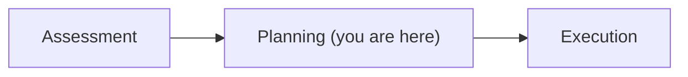

# 02 · Planning

By the end of this chapter you'll have generated the agent's default plan, produced your
own version of it, and diffed the two to see exactly what your judgment changed.

**Time: ~45 minutes** · **You need:** a reviewed `assessment.md` from Chapter 01

## What you'll do

- Generate the default plan and save a copy of it
- Reorder, split, and annotate tasks
- Regenerate and diff the two plans
- Learn which planning files you may edit and which one will silently overwrite you

Diagram: you are at stage two of three.



## Before you start

If you don't have a reviewed assessment, jump to the checkpoint:

```powershell
.\scripts\Reset-Course.ps1 -Checkpoint 02-planning
```

## Steps

### 1. Generate the default plan

Tell the agent to continue:

```text
Continue to planning.
```

It writes `plan.md` into `.github/upgrades/{scenarioId}/`. A plan is an **ordered list of
tasks**, each with a scope, a rationale, and a validation step.


### 2. Save a copy before you touch it

This is the trick that makes the rest of the chapter work:

```powershell
Copy-Item .github\upgrades\<scenarioId>\plan.md .\plan-default.md
```

Replace `<scenarioId>` with the folder name you found in Chapter 00.

You now have a frozen baseline. Everything you change from here is measurable.

### 3. Know what you're allowed to edit

| File | What it is | Editable? |
|---|---|---|
| `assessment.md` | The analysis | ✅ Add context |
| `upgrade-options.md` | Your confirmed decisions | ✅ Override in chat |
| `plan.md` | The ordered task list | ✅ Reorder, split, add, remove, annotate |
| `scenario-instructions.md` | The agent's persistent memory | ✅ The main steering lever |
| `tasks.md` | Live progress dashboard | ❌ **Read-only** |
| `tasks/{taskId}/task.md` | One task's scope | ✅ Refine scope, add examples |
| `tasks/{taskId}/progress-details.md` | What the agent did and hit | Read it when debugging |

**Do not edit `tasks.md`.** The agent's tools manage it as a read-only dashboard and
overwrite any manual changes. If you want to change what happens, edit `plan.md`,
`tasks/{taskId}/task.md`, or `scenario-instructions.md` instead.
{: .warning }

That distinction trips up almost everyone once. `tasks.md` looks like the most editable
file in the folder — it's a checklist. It's the one file that isn't.

### 4. Change the plan

Read `plan.md` against your worksheet from Chapter 01 and look for four things.

**Wrong order.** Does anything depend on work scheduled after it? BookCatalog's
`BookCatalog.Web` cannot compile until `BookCatalog.Core` targets .NET 10.

**Tasks that are too big.** "Migrate ASP.NET MVC 5 to ASP.NET Core" is not one task. It's
routing, plus filters, plus static files, plus views, plus startup and DI. A task large
enough to fail halfway leaves you with a mess that's hard to attribute.

**Missing validation.** Every task should end by building and running your tests. If a
task doesn't, add it.

**Unstated decisions.** If the plan says "migrate data access" without saying whether you
land on EF Core or stay on EF6, decide now and write it down.

Edit the file directly. Reorder headings, split a section into two, add a rationale line
under any task where you overrode the agent:

```markdown
### Task 4 — Replace packages.config with PackageReference

**Why this moved earlier:** every later task touches project files. Doing the format
migration first means nothing downstream has to handle both formats.
```

Or drive it from chat:

```text
Reorder the plan so BookCatalog.Core is fully upgraded and its tests pass before any work
starts on BookCatalog.Web.
```

```text
Split the ASP.NET MVC migration task into separate tasks for routing, filters, static
files, and views.
```

```text
Add a validation step to every task that builds the solution and runs the characterization
tests.
```

### 5. Diff the two plans

```powershell
git diff --no-index .\plan-default.md .github\upgrades\<scenarioId>\plan.md
```

Read the diff and answer one question for each hunk: **what did I know that the agent
didn't?**

Common answers: dependency order the agent inferred but got backwards; a task boundary
that matches how your team reviews code; a decision the agent left open because it's a
business decision.

That diff is the deliverable of this chapter. It's the most concrete evidence you'll get
that plan review is worth the time.
{: .tip }

### 6. Approve it

```text
The plan looks good. Proceed with execution.
```

In Guided mode the agent pauses before starting each task. Keep it there for Chapter 03.

## What just happened

You saw why planning is a separate stage rather than something folded into execution.

Planning is where the **order** and **shape** of the work gets decided, and it's the last
point where changing your mind is free. Once execution starts, moving a task means
unwinding commits.

That's also why the artifacts are files rather than a UI. A plan you can diff, review, and
put in a pull request is a plan your team can argue about before anything ships.

## Try changing it

Delete a task entirely and ask what breaks:

```text
Remove the packages.config migration task. What happens to the rest of the plan?
```

The agent should tell you which downstream tasks now have a problem. If it doesn't, that's
useful information about how much dependency reasoning it's actually doing — and a reason
to keep reviewing plans yourself.

## If something goes wrong

| Problem | What to do |
|---|---|
| Your edits to `tasks.md` vanished | Expected. That file is agent-managed. Edit `plan.md` or `task.md` instead |
| The plan regenerated and lost your changes | Put durable preferences in `scenario-instructions.md`, which survives regeneration. See [Chapter 04](../04-teaching-the-agent/README.md) |
| The plan has 30 tasks | Fine for a large solution. Check the ordering and the first five carefully; the rest will shift anyway |
| You can't find `plan.md` | Confirm assessment completed and check `.github/upgrades/` for the actual scenario folder name |

## Check yourself

1. Which planning file is read-only, and what happens if you edit it?
2. Name one change you made to the plan and the thing you knew that the agent didn't.
3. Why is reordering tasks cheap now and expensive in an hour?

---

Next → [Chapter 03: Execution](../03-execution/README.md)
