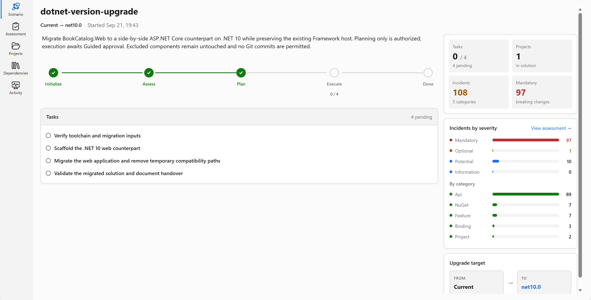
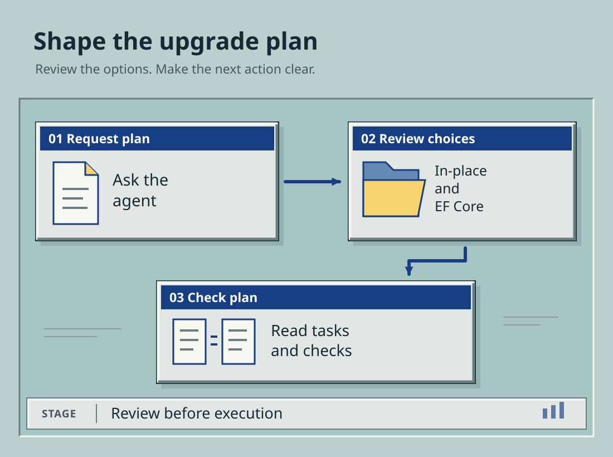

# Chapter 02: Choose the upgrade plan

The assessment lists the work. The plan puts that work in order.
You'll ask the modernization agent for a plan, review its choices, and check how it will run the finished app.

Keep `shared-legacy-app\BookCatalog.sln` open in Visual Studio.
Use the same modernization chat and assessment from Chapter 01.

## Ask for the plan

Send this request before making any application changes:

```text
@Modernize create plan.md for .NET 10 migration.
Use the existing BookCatalog assessment and Guided mode.
Upgrade BookCatalog.Web in place to ASP.NET Core MVC with EF Core.
Use an All-at-Once strategy for this single web project.
Use native ASP.NET Core APIs. Do not add System.Web Adapters or a YARP proxy.
Keep the current book-list page and forms.
This is a demo. Existing books do not need to survive the upgrade.
Use EF Core to create the BookCatalogModernizedLab LocalDB schema and seed books.
You may recreate that demo database when needed.
Do not add backup, export, import, shared-schema, or record-preservation tasks.
Do not recreate the database on every startup; saved edits must survive a restart.
Limit application changes to shared-legacy-app\BookCatalog.sln and BookCatalog.Web.
Exclude the data helper, completed reference, test projects, and course website.
Do not execute the upgrade or create Git commits.
Stop when the plan is ready for review.
```

The named database gives the agent a concrete demo target.
This exercise rebuilds the schema and seed data from EF Core. It isn't a data migration.

## Understand the choices

<a id="choose-the-ef-approach-deliberately"></a>
<a id="your-decision-what-evidence-justifies-ef-core-now"></a>

The agent can ask you to **confirm**, **change**, or enter a **free-form answer** for its proposed options.
Don't confirm all defaults without reading them.

The recorded run proposed side-by-side projects, System.Web Adapters, and keeping EF6.
That creates a more complex migration than this demo needs.
Use these choices for the course:

| Option | Choose | Meaning for BookCatalog |
| --- | --- | --- |
| Upgrade Strategy | **All-at-Once** | Upgrade the one web project as a single group |
| Project Approach | **In-place rewrite** | Replace the Framework implementation in the existing web project |
| Unsupported API Handling | **Fix Inline** | Replace incompatible APIs during the upgrade, rather than leaving stubs |
| System.Web Adapters | **Direct Migration to ASP.NET Core APIs** | Use ASP.NET Core directly, without running a second web host or proxy |
| Entity Framework | **Migrate to EF Core** | Rebuild the demo data model, schema, and seed setup with EF Core |
| Nullable Reference Types | **Leave Disabled** | Keep a separate nullability cleanup out of this exercise |
| Assembly Binding Redirects | **Document and Review Before Removing** | Check the legacy redirects. Don't copy them into ASP.NET Core |

EF6 and EF Core are different versions of Entity Framework, the library that reads and writes the database.
We're replacing EF6 as part of this small demo.

If the proposed options differ, select **change** or use the free-form answer to specify the choices above.
Confirm the corrected options. This approval is for planning, not execution.

## Know which artifact you are changing

When planning finishes, the **Upgrade Agent Dashboard** shows the plan and tasks.
Ask the agent to open the scenario's `plan.md`.

| File | What it contains |
| --- | --- |
| `assessment.md` | The original compatibility findings and any requirements you added |
| `plan.md` | The selected approach, application changes, and completion checks |
| `scenario-instructions.md` | The choices and instructions the agent carries into execution |
| `tasks.md` | The task list and current progress |

The supplied recording contains all four files.
Some versions also create `upgrade-options.md`. If yours doesn't, read the **Upgrade Options** section in `plan.md` or `scenario-instructions.md`.



[Open the full-size dashboard screenshot](../examples/assessments/bookcatalog/images/ch2-1-dashboard-plan.png).

This screenshot shows the earlier side-by-side plan, not the in-place choices used here.
The [recorded planning excerpts](../examples/assessments/bookcatalog/planning-excerpts.md) explain that difference.

Use the scenario directory reported by the agent.
The repository's root `plan.md` isn't your application upgrade plan.

## Check the generated plan

Open `plan.md` and `scenario-instructions.md`. Check that both describe:

- One web project upgraded in place to .NET 10.
- ASP.NET Core MVC and EF Core.
- The current book-list page and forms.
- EF Core creating the demo schema and seed books.
- No side-by-side host, shared-database work, proxy, or data-transfer tasks.

If either file still requires preserving existing records or keeping EF6, send:

```text
@Modernize Correct plan.md, scenario-instructions.md, and tasks.md for this demo.
Use an in-place ASP.NET Core MVC upgrade with EF Core.
Existing records are disposable. Rebuild the schema and seed books with EF Core.
Remove old-host, proxy, shared-schema, backup, and data-preservation tasks.
Use BookCatalogModernizedLab as the demo database.
Allow recreation when needed, but keep saved edits across normal app restarts.
Show the corrected files. Do not execute yet or create Git commits.
```

Read the changed files before continuing. A chat acknowledgement doesn't tell you whether the saved plan changed.

## Add a useful run step

<a id="define-runnable-groups"></a>
<a id="change-one-inadequate-plan-step"></a>

Find the validation section or final task in `plan.md`.
Add the following instruction if it isn't already there:

```text
After the conversion builds, launch BookCatalog from Visual Studio
using the new project profile, not the old IIS Express configuration.
Open the book list, add an active sample book, and edit its title.
Restart the app and check that the saved title remains.
Mark any check that was not run as not run.
```

Save the file. Ask the agent to use it:

```text
@Modernize Read the launch and app-use instruction in plan.md.
Include it in the final validation task and scenario-instructions.md.
Show the updated task. Do not execute or create Git commits yet.
```



## Approve the plan, not the execution

Open **View > Git Changes**. At this point, the agent should have changed scenario files, not converted the application.
Continue when the saved plan matches the choices above and includes the launch/add/edit/restart check.

<a id="export-the-selected-records-before-the-upgrade"></a>
<a id="optional-copy-your-own-records"></a>
The separate [data-transfer exercise](../docs/data-transfer.md) isn't part of this upgrade.

**[Next: run the upgrade](../03-upgrade-execution/README.md)**

## Reference

- [Upgrade strategies and flow modes](https://learn.microsoft.com/dotnet/core/porting/github-copilot-upgrade/concepts)
- [EF6 to EF Core](https://learn.microsoft.com/ef/efcore-and-ef6/porting/)
- [EF Core schema creation](https://learn.microsoft.com/ef/core/managing-schemas/ensure-created)
