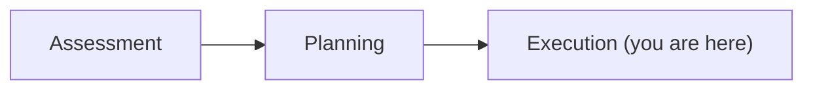

# 03 · Execution

By the end of this chapter your app will build and run on .NET 10 — and you'll have
recovered from at least one task the agent got wrong.

**Time: ~60 minutes**, plus ~40 for the optional exercise · **You need:** an approved plan
from Chapter 02

## What you'll do

- Run execution in Guided mode and watch it work task by task
- Read the per-task files that tell you what actually happened
- Deliberately break a task, then recover from it three different ways
- Prove the app still behaves the same way it did before
- Write the characterization tests the codebase never had

Diagram: you are at stage three of three.



## Before you start

If you want to skip ahead to a finished upgrade:

```powershell
.\scripts\Reset-Course.ps1 -Checkpoint 03-modernized
```

Commit before you start. Everything below assumes you can `git revert` a bad task.
{: .warning }

## Steps

### 1. Start execution

```text
Start execution.
```

The agent works one task at a time. For each task it:

1. Makes the code changes in that task's scope
2. Builds the solution
3. Runs your existing tests
4. Fixes what it broke, iterating until the build and tests pass
5. Commits, then pauses (in Guided mode) and asks to continue

That inner loop is the part people miss. **Validation isn't a phase at the end — it runs
inside every task.** A task that can't reach green doesn't quietly move on; it stops and
tells you.

Step 3 is doing nothing here. BookCatalog has no tests, so the agent discovers none, finds
nothing to run, and moves on. The loop still works — it's just running on half an engine,
with the compiler as its only judge. Keep that in mind for the rest of the chapter; it's
the difference between "the agent verified this" and "the agent compiled this."
{: .warning }


### 2. Watch the right files

Three files tell you what's going on. Keep them open.

**`tasks.md`** — the live dashboard. Which task is running, what's done, what failed. Read
it. Never edit it.

**`tasks/{taskId}/task.md`** — this task's scope and instructions. Editable, and the
narrowest place to correct the agent's behavior.

**`tasks/{taskId}/progress-details.md`** — what the agent did, what errors it hit, and
what it tried in response. **This is where you debug.** When a task fails, this file
usually tells you why in one read.

Also useful: **View → Output → AppModernizationExtension** for live logging.

### 3. Steer while it runs

You are not stuck with the mode you picked.

| Say this | Effect |
|---|---|
| `pause` | Switch to Guided — stop at every boundary |
| `continue` | Switch to Automatic — run through without asking |

Start Guided. Once you've watched three or four tasks and you trust the shape of them,
say `continue` and let it run. Switch back the moment something looks off.

You can also correct a task in flight:

```text
Stop. In this task, don't replace Web.config wholesale — migrate only the connection
strings and app settings to appsettings.json and leave the rest for a later task.
```

### 4. Recover from a failed task

Some task will fail. That's normal, and handling it is the actual skill in this chapter.
You have three moves, in increasing order of force.

**Move 1 — narrow the scope.** Read `progress-details.md`, then edit
`tasks/{taskId}/task.md` to say what the agent should and shouldn't touch. Ask it to retry
the task. Use this when the agent had the right idea and the wrong boundaries.

**Move 2 — do it yourself and teach it.** Fix one instance by hand, then tell the agent to
learn from your fix. That's [Chapter 04](../04-teaching-the-agent/README.md), and it's the highest
leverage move in the product.

**Move 3 — revert.** If a task made a mess, throw it away:

```powershell
git log --oneline
git revert <commit-sha>
```

This is why you let the agent commit per task. Every task is independently undoable, and
that turns "the agent broke my app" into "I dropped one commit."

Then adjust the plan or the task scope and re-run it. Reverting isn't failure — it's the
loop working.
{: .tip }

### 5. Try it on purpose

Do this once, deliberately, in a safe place. It's much better to learn recovery now than
during a real upgrade.

Pick a task that hasn't run yet and sabotage its scope:

```markdown
<!-- in tasks/{taskId}/task.md -->
Also delete all view files in this task.
```

Run it, watch it go wrong, then recover with move 3. Now you know what the failure looks
like, what `progress-details.md` says about it, and how fast the undo is.

### 6. Prove behavior didn't change

BookCatalog has no tests, so "the build is green" is the *only* automated signal you have.
That signal tells you the code compiles. It tells you nothing about whether the app still
works.

So do it by hand, deliberately:

```powershell
dotnet build .\BookCatalog.slnx --configuration Release
dotnet run --project .\src\BookCatalog.Web
```

Then walk the app and confirm each of these against what you saw in Chapter 00:

| Check | What you're looking for |
|---|---|
| `/Books` loads | Same books, same order, same count |
| Create a book | Saves, redirects, appears in the list |
| Submit an invalid book | Still rejected, same field-level messages |
| Edit a book | Change persists after a reload |
| Delete a book | Gone from the list, and stays gone |
| Request a book ID that doesn't exist | Still a 404, not a 500 |

And check the three things that break quietly on an EF6 → EF Core move:

- **In-memory versus database behavior.** An in-memory provider doesn't catch SQL
  translation differences. Run at least one pass against LocalDB.
- **Generated migration SQL.** Read it before it ever touches real data.
  `dotnet ef migrations script` prints what will actually run.
- **Data reconciliation.** Row counts, a few known records, one report total.

Details and a checklist are in
[proving behavior didn't change](../docs/VALIDATION.md).

### 7. Exercise — write the tests you wish you'd had

You just validated an upgrade by clicking through a web app. It worked, and it doesn't
scale. Six controllers in, you'd stop doing it properly.

This is the exercise. Budget 30–45 minutes.

**Go back to the legacy app, before the upgrade**, and write characterization tests
against it:

```powershell
.\scripts\Reset-Course.ps1 -Checkpoint legacy-baseline
```

Write tests that capture what the app does *today* — not what it should do. If the legacy
app returns books in an odd order, your test asserts the odd order. A characterization
test is a recording, not a specification.

Start with the six rows in the table above. For each one, ask: what's the smallest
assertion that would fail if this behavior changed?

Then run the upgrade again with those tests in place, and tell the agent about them:

```text
This solution now has characterization tests under tests/. Run them as the validation step
for every task, and stop if any of them fail.
```

Watch what changes. The agent now has a real signal, so it self-heals against your intent
instead of against the compiler. Task failures surface immediately instead of at the end.

A worked solution lives in `checkpoints/04-validated/tests/` — ten tests against the
*modernized* app covering exactly this ground. Write yours first, then compare. The point
isn't matching it; it's noticing what you didn't think to pin down.
{: .tip }

You'll do this on every real modernization you ever run. The agent's validation loop is
only as good as the evidence you give it, and on most legacy codebases that evidence
doesn't exist until you write it.

## What just happened

Execution is where the three-stage split pays for itself.

Because assessment produced facts and planning produced an ordered, reviewed list, every
change the agent made had a stated reason and a scope you agreed to. When a task failed you
knew which task, why, and what to undo — because it was one commit with one job.

Run all three stages as one blur and you get the opposite: a large diff, no rationale, and
a bisect problem.

## Try changing it

Ask the agent to explain itself after a task completes:

```text
Summarize what changed in this task and why. What did you decide that I should review?
```

Then diff the commit yourself and see whether the summary matches. Building calibration
about when to trust the summary — and when to read the diff — is worth more than any
individual fix.

## If something goes wrong

| Problem | What to do |
|---|---|
| A task loops trying to fix the same error | Stop it. Read `progress-details.md`, narrow `task.md`, retry |
| A page that worked now throws | Read the failure. If it's a real behavior change, revert the task and re-scope it |
| The agent edits files outside the task scope | Say so, and put the boundary in `task.md`. If it keeps happening, put it in `scenario-instructions.md` |
| Execution is slow | Large solutions take a while. Watch the Output window rather than the chat pane |
| You've lost track of what changed | `git log --oneline` — one commit per task is your map |

More in [troubleshooting](../docs/TROUBLESHOOTING.md).

## Check yourself

1. Which file do you open first when a task fails?
2. Why does one commit per task matter more than it seems?
3. Name something a green build would not catch after an EF6 to EF Core migration.
4. What changes about the agent's behavior once you give it real tests to run?

---

Next → [Chapter 04: Teaching the agent](../04-teaching-the-agent/README.md)
