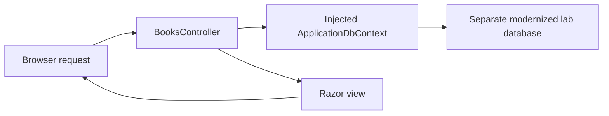

# Chapter 03: Upgrade and check the application

The plan now defines your changes and their review boundaries. Execute one coherent group, inspect its result, and decide whether to proceed.

Start with the reviewed plan commit from [Chapter 02](../02-planning/README.md). Keep the legacy behavior record available.

By the end, your app will target .NET 10 and use ASP.NET Core MVC with EF Core. Your checks will describe what you tested.

## Authorize one execution group

Review the plan, pending diff, and selected mode. Then send:

```text
Execute the first approved runnable group.
Keep our separate-database constraint and behavior checks.
Do not create Git commits. Pause for my review after this group.
If you cannot finish the group, explain the incomplete state.
Do not start the next group until I approve it explicitly.
```

Check the agent's response. Guided mode does not guarantee a pause after every internal task.

Inspect each requested command before approval. Check its working directory and target files. Do not authorize a reset or database deletion to make progress easier.

## Check the SDK and project changes

From `shared-legacy-app` in PowerShell:

```powershell
dotnet --version
```

The result must select a stable .NET 10 SDK. The existing `global.json` uses `latestFeature`, so a later stable .NET 10 feature band is acceptable.

Inspect `src/BookCatalog.Web/BookCatalog.Web.csproj` after the application conversion group.

You should find an SDK-style web project targeting `net10.0`. MVC 5 package references and `System.Web` references should no longer drive the application.

Do not require a particular package patch version from an old screenshot. Check compatible versions and the reasons for package changes.

## Inspect responsibilities, not only filenames

| Legacy responsibility | New location or approach | What you check |
| --- | --- | --- |
| `Global.asax.cs` startup | `Program.cs` | MVC services and request routes exist |
| `RouteConfig` | Endpoint routing | The root route still reaches the book list |
| `BooksController` MVC APIs | ASP.NET Core controller APIs | Missing records return 404 and writes retain validation |
| `web.config` connection | Application configuration | The modernized connection uses the separate lab database |
| Controller-owned context | Constructor injection | The context has the intended request lifetime |
| EF6 initializer | Explicit schema/seed strategy | The legacy MDF stays untouched |
| Razor views and static files | ASP.NET Core views and `wwwroot` | Forms, links, styles, and antiforgery tokens work |



The context executes database operations. The controller selects a response. The view renders the result. A change in one responsibility can affect the others.

<div class="activity">

### Your review: did the edit preserve the behavior?

Inspect the generated `Edit` action. Find where it updates an existing record.

Check that editable fields change without replacing `CreatedDate`. Inspect the corresponding create action for the original local-time behavior.

Explain why a replacement that assigns every property can pass a build but still fail this review.

</div>

<details>
<summary>Compare your review</summary>

The legacy edit action leaves `CreatedDate` unchanged. The create action sets it with `DateTime.Now`.

Copying a posted creation date into the existing record changes that behavior. A build checks types and references, not the intended meaning of the date.

</details>

## Rebuild, run, and repeat the checks

Finish the entire runnable group before this step. From `shared-legacy-app` in PowerShell:

```powershell
dotnet build src/BookCatalog.Web/BookCatalog.Web.csproj --no-incremental
dotnet run --project src/BookCatalog.Web/BookCatalog.Web.csproj
```

Open the loopback URL from the console. If you use Visual Studio, select the new project launch profile rather than the old IIS Express configuration.

Check warnings instead of treating an unchanged incremental build as fresh evidence. Resolve errors before proceeding.

Repeat [the behavior contract](../docs/validation.md#behavior-contract) with disposable records in the modernized database.

Check the list, forms, invalid input, inactive records, missing records, edits, and deletion. Restart the app to check persistence.

The legacy records do not transfer to this database. This exercise tests application behavior, not data migration.


## Save a real checkpoint

Stop the application after the checks. From the repository root in PowerShell:

```powershell
git status --short
git diff --stat
git diff
git add shared-legacy-app .github/upgrades
git diff --cached
git commit -m "Upgrade BookCatalog and record behavior checks"
```

Inspect the staged changes before the commit. Do not stage database files, credentials, unrelated edits, or build output.

Request the next planned group explicitly if work remains. Keep the same pause, review, and commit rules.

## Recover without discarding your work

If a task fails, inspect its log under `.github/upgrades/{scenarioId}/tasks/{taskId}/progress-details.md`.

Ask the agent to state the current incomplete condition. Give it the actual error and the last successful check.

If you close the IDE, reopen the same solution and branch. Ask the agent to identify the existing scenario and pending task before it edits.

If you need a reference, open [the completed example](../examples/modernized/README.md) in a separate directory. Do not copy it over your learner project.

If SQL startup fails, check the selected database and LocalDB instance. `EnsureCreated()` does not repair an incompatible existing schema.

Do not delete the legacy MDF as a repair step.

## Make an independent change

Add an optional author filter to the book list. Keep active-only results and title order.

First, write the change and its checks in your own words. Then use the agent to inspect and edit the relevant controller and view.

Check a matching author, a nonmatching author, and an empty filter. Check that an inactive matching book remains absent.

<details>
<summary>Worked approach after your attempt</summary>

In `BooksController.Index`, start with the active-book query. Add the author condition before materializing the results.

This fragment describes the query inside the action. Adapt the context variable to your implementation:

```csharp
var query = db.Books.Where(book => book.IsActive);
if (!string.IsNullOrWhiteSpace(author))
{
    query = query.Where(book => book.Author.Contains(author));
}
var books = await query.OrderBy(book => book.Title).ToListAsync();
```

Add a nullable `author` parameter to the action. Add a GET form in `Views/Books/Index.cshtml` with an input named `author`.

Keep the original condition when the filter is empty. Define case-matching expectations for your database rather than assuming all providers behave identically.

Check the complete action and view before you commit the change.

</details>

## Finish the core workshop

Save your independent change after its checks pass. Record any remaining limitations instead of claiming a production-ready application.

You can now assess, plan, inspect generated changes, and check selected behaviors. Apply that process to another application with its own risks and tests.

**[Optional: prepare for Azure](../04-cloud/README.md)** · **[Course overview](../README.md)**
