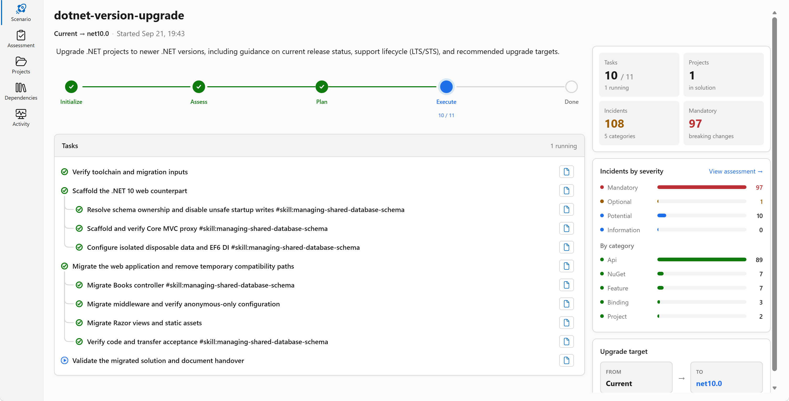
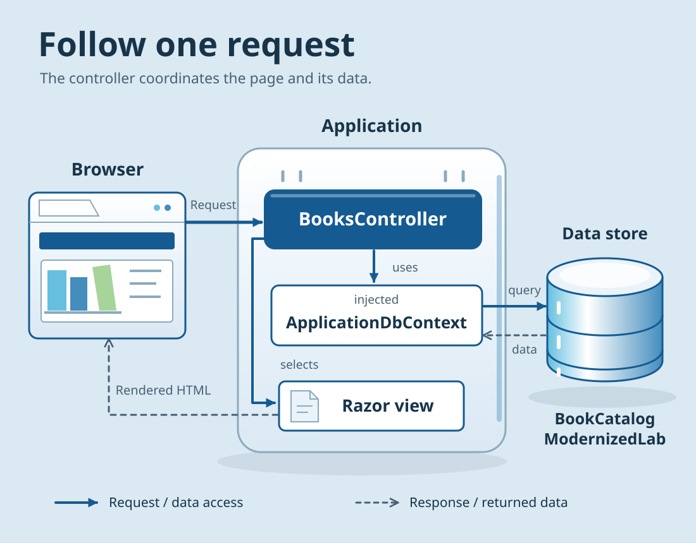

# Chapter 06: Upgrade and check the application

Now the modernization agent will change BookCatalog using the plan you reviewed.
You'll inspect the result, launch it from Visual Studio, and try the book forms.

Keep `shared-legacy-app\BookCatalog.sln` open.
Use the same scenario and chat from Chapter 05.

## Authorize the upgrade

<a id="authorize-one-execution-group"></a>
Send this request:

```text
@Modernize Execute the reviewed BookCatalog plan in this scenario.
Upgrade the existing BookCatalog.Web project in place to .NET 10,
ASP.NET Core MVC, and EF Core.
Keep the current book-list page and forms.
Rebuild the demo schema and seed books with EF Core in BookCatalogModernizedLab.
Existing records are disposable. Recreate that demo database if needed.
Do not add data-preservation, backup, export, import, or shared-schema tasks.
Keep saved edits across normal app restarts.
Keep the helper, reference, test projects, and course website out of scope.
Do not create Git commits, provision Azure resources, or deploy.
Build the app and report the result.
Tell me which Visual Studio profile to launch and which app-use checks remain.
```

Review and approve requests to edit the learner project, restore packages, and build it.
The plan already permits rebuilding the demo database. You don't need an additional preservation workflow.

The **Upgrade Agent Dashboard** shows execution progress.
Open a task there to read its details. The agent also updates `tasks.md` and may create files under a `tasks` directory.
Task counts and names can differ from the screenshots in the [recorded example](../examples/assessments/bookcatalog/README.md).



[Open the full-size dashboard screenshot](../examples/assessments/bookcatalog/images/ch3-2-most-tasks-complete.png).

The [saved execution record](../examples/assessments/bookcatalog/execution-excerpts.md) reports 10 of 11 tasks complete.
It doesn't establish a successful Visual Studio launch or saved edits after restart.

## If the agent keeps working on database preservation

The supplied run was still in progress after more than five hours.
It had selected a side-by-side migration with shared-database constraints.
That's why this course now specifies an in-place EF Core demo rebuild.
That report isn't a completion-time estimate for your run.

If tasks keep adding backups, shared-schema work, or old-host compatibility, use the **Stop** control in Copilot Chat.
Then send:

```text
@Modernize Continue the existing scenario with this corrected demo scope.
Keep the completed application changes.
Use one in-place ASP.NET Core MVC project with EF Core.
Existing records are disposable. Recreate BookCatalogModernizedLab if needed.
Remove data-preservation, shared-schema, backup, export, import, and old-host tasks
from plan.md, scenario-instructions.md, tasks.md, and pending task instructions.
Do not add a proxy or a second web host.
Keep the database between normal app restarts.
Show the revised remaining tasks before continuing execution.
Do not reset my work or create Git commits.
```

Read the remaining tasks in the dashboard.
If they match the demo scope, send `@Modernize Execute the revised remaining tasks.`
If the agent reports a specific error, use the error-recovery instructions below instead of repeating the same request.

## Check the SDK and project changes

After the agent reports that the conversion builds, open **View > Git Changes**.
Open the diff for `shared-legacy-app\src\BookCatalog.Web\BookCatalog.Web.csproj`.

The project should now use `Microsoft.NET.Sdk.Web` and target `net10.0`.
Look for EF Core package references instead of the EF6 package.
Legacy MVC 5 and `System.Web` references should no longer be required by the upgraded project.

## Inspect responsibilities, not only filenames

Open these files under `shared-legacy-app\src\BookCatalog.Web`:

| File | What to check |
| --- | --- |
| `Program.cs` | Registers MVC and the database context, then maps the book routes |
| `Controllers\BooksController.cs` | Uses ASP.NET Core actions and receives its context through the constructor |
| `appsettings.json` | Configures the `BookCatalogModernizedLab` demo database |
| `Views\Books` | Contains the book list and forms |
| `Properties\launchSettings.json` | Defines a project profile that Visual Studio can launch |

The agent may put database creation and seed code in another file.
Ask it to identify that file if it isn't in `Program.cs`.
The code should create the schema when needed, not erase the catalog each time you start the app.

Dependency injection means ASP.NET Core creates the configured database context and passes it to the controller.



<a id="your-review-did-the-edit-preserve-the-behavior"></a>
Read the controller's `Edit` action.
It should update the editable book fields without replacing the book's creation date with a form value.

## Rebuild, run, and repeat the checks

1. Select **Build > Rebuild Solution**.
2. Wait for a successful build in **View > Output**.
3. In **Solution Explorer**, right-click `BookCatalog.Web` and select **Set as Startup Project** if needed.
4. Open the list beside Visual Studio's green start button.
5. Select the project profile the agent reported, usually `http` or `https`, not **IIS Express**.
6. Press F5.

The profile's `commandName` is `Project` in `Properties\launchSettings.json`.
If no project profile exists, ask the agent to add one to `BookCatalog.Web`, then rebuild.

Use the browser address opened by Visual Studio. The port can differ from the original app.
Expect the book list and seed books. You don't need the books you added in Setup.

## Check your actual upgraded application

1. Open a book's details page.
2. Return to the list and select **Add New Book**.
3. Enter a sample title and author.
4. Select **Active** and save.
5. Open the new book's **Edit** link.
6. Change the title and save.
7. Select **Debug > Stop Debugging** in Visual Studio.
8. Press F5 to start the app again.
9. Check that the list still shows the changed title.

If the edit disappears, ask the agent to check the database connection and startup initialization.
It must keep the database between normal restarts. Repeat the add/edit/restart check after the fix.

A completed dashboard task or a successful build doesn't replace this browser check.
The completed reference's tests don't test your generated application.

## Save a real checkpoint

Stop debugging. Open **View > Git Changes** and review the files that changed.
Keep the generated application and scenario files in your learner copy.
The course doesn't require a commit.

Ask the agent to leave checks it didn't run marked **not run**.
If you performed the browser check yourself, tell it which actions passed so it can record your result.

## Recover without discarding your work

For a build or runtime error, copy the full error from **Output** into the same chat.
Replace the last line below with that error:

```text
@Modernize Fix this error in the current BookCatalog upgrade scenario.
Use the reviewed in-place .NET 10 and EF Core demo plan.
Keep completed work and update the affected task.
Do not reset the repository or create Git commits.
Error:
<paste the complete error here>
```

For a database-schema mismatch, the agent can recreate `BookCatalogModernizedLab` from EF Core.
It doesn't need to recover the old records.
After repair, rerun the app and repeat the add/edit/restart check.

If you reopen Visual Studio later, ask the agent to find this scenario and show its first unfinished task.
Read that task before approving more work.

## Finish the local upgrade

<a id="finish-the-core-workshop"></a>
Continue when your generated .NET 10 app builds, opens, and keeps a saved edit after restart.
Chapter 07 uses this upgraded solution.

<a id="preview-copy-and-verify-the-selected-records"></a>
<a id="check-the-legacy-source-remains-unchanged"></a>
<a id="make-an-independent-change"></a>
<a id="optional-data-and-independent-change-exercises"></a>
**[Next: assess and plan for Azure](../04-cloud/README.md)** · **[Course overview](../README.md)**
