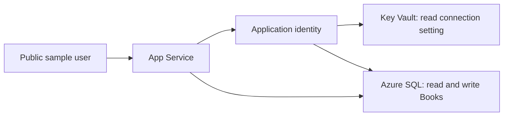

# Chapter 04: Prepare for Azure

This optional extension takes your working local application to Azure. You will change configuration and identity, review infrastructure, and check persisted behavior.

You can finish the core workshop without this chapter. Start here only after [Chapter 03](../03-upgrade-execution/README.md) passes its behavior checks.

> **Use a dedicated lab subscription or approved lab scope.** This exercise creates billable resources and a publicly accessible sample application.
>
> Use sample data only. The sample does not authenticate its users. Anyone with its public URL can change its book records.

## Check tools, access, and costs first

Use PowerShell on the Windows machine that hosts your learner project. Start in the repository root.

The application still uses .NET. The bootstrap helper also needs Node 24. Node is a supporting tool, not the application's runtime.

```powershell
az version
az bicep version
node --version
npm --version
dotnet --version
```

If a tool is missing, use the [Azure CLI installer](https://learn.microsoft.com/cli/azure/install-azure-cli), [Bicep instructions](https://learn.microsoft.com/azure/azure-resource-manager/bicep/install), or [Node installer](https://nodejs.org/en/download).

Sign in to the intended Azure tenant. Select the approved subscription:

```powershell
az login
$subscriptionId = "<your-subscription-id>"
az account set --subscription $subscriptionId
az account show --query "{subscription:id,tenant:tenantId,user:user.name}" -o json
```

Check these permissions before proceeding:

| Operation | Required access |
| --- | --- |
| Create the dedicated group and resources | Resource creation permissions in the approved scope |
| Assign Key Vault roles | Role-assignment permissions, such as Owner or an appropriate delegated role |
| Apply the database schema | The Microsoft Entra user configured as SQL administrator |
| Store the connection setting | Key Vault Secrets Officer on the lab vault |
| Run the application | The template's managed identity and its limited vault/table permissions |

Contributor alone cannot assign roles. This template expects a signed-in Microsoft Entra **user**, not a service principal or group administrator.

The reference provisions a Linux App Service plan, web app, Azure SQL server/database, Key Vault, and a user-assigned identity.

Its defaults use App Service B1 and SQL Standard S0. They are not a promise of free hosting or available regional capacity.

Review all services in the [Azure pricing calculator](https://azure.microsoft.com/pricing/calculator/) for your region and subscription. Obtain approval before provisioning.

Review [cleanup](#delete-the-dedicated-lab-group) now. Keep resources inside the dedicated group. Do not reuse a group with other workloads.

## Ask the agent for cloud-readiness findings

Open your modernized solution in the Copilot modernization chat. Send:

```text
Assess this modernized BookCatalog app for Azure.
Do not provision resources or deploy code.
Explain the changes needed for App Service, Azure SQL, Key Vault,
and a user-assigned managed identity.
Keep the application on sample data and use a dedicated lab group.
Identify the files and checks for each preparation step.
```

The LocalDB file cannot act as the Azure database. Its integrated connection does not expose a SQL password, but it requires different cloud authentication.

A managed identity is an Azure identity for the application. It replaces stored credentials when the application accesses Key Vault and SQL.

Key Vault stores the connection setting. It does not sit between the application and every SQL request.



## Prepare the application explicitly

Set the project path from the repository root:

```powershell
$project = (Resolve-Path "shared-legacy-app/src/BookCatalog.Web/BookCatalog.Web.csproj").Path
```

Check that this is your upgraded application, not the completed reference.

Ask the agent to add `Azure.Identity` and `Azure.Extensions.AspNetCore.Configuration.Secrets`. Review the package versions and diff.

In `Program.cs`, add `using Azure.Identity;`. Add this configuration block after builder creation and before reading the connection string:

```csharp
var vaultName = builder.Configuration["KeyVaultName"];
if (!string.IsNullOrWhiteSpace(vaultName))
{
    var clientId = builder.Configuration["AZURE_CLIENT_ID"]
        ?? throw new InvalidOperationException("Set AZURE_CLIENT_ID.");
    builder.Configuration.AddAzureKeyVault(
        new Uri($"https://{vaultName}.vault.azure.net/"),
        new ManagedIdentityCredential(
            ManagedIdentityId.FromUserAssignedClientId(clientId)));
}
```

The vault name is absent during normal local use. In Azure, the template supplies both settings.

Find all automatic schema calls in startup. Put local initialization behind the `InitializeDatabase` setting and the separate local database-name check.

Use [the reference `Program.cs`](../examples/modernized/src/BookCatalog.Web/Program.cs) to inspect that guard. Adapt the focused block rather than replacing your startup file.

Set `InitializeDatabase` to `true` in local configuration. The Azure template sets it to `false`.

Keep the LocalDB connection for local use. Do not place SQL passwords or Azure credentials in source files.

Rebuild and run locally. Repeat the saved-record check before provisioning anything.

## Produce a schema from your application

Use an EF Core design-time factory to generate SQL without connecting to a database.

Inspect [the reference factory](../examples/modernized/src/BookCatalog.Web/Models/DesignDbContextFactory.cs). Add the equivalent file to your application's `Models` directory.

Match its context type and namespace to your application. The factory supplies SQL Server options for script generation.

Add `Microsoft.EntityFrameworkCore.Design` at the same version as your other EF Core packages. The reference uses the versions recorded in its project file.

From the repository root:

```powershell
dotnet tool restore
New-Item -ItemType Directory -Force .azure-lab
dotnet ef dbcontext script --project $project --output .azure-lab/schema.sql
if ($LASTEXITCODE -ne 0) { throw "Schema generation failed." }
```

Inspect `.azure-lab/schema.sql`. It must create the expected `Books` table. It must not target or delete the legacy database.

If your model supplies seed data, inspect those inserts too. The helper does not copy your local records.

## Review the infrastructure

Open [the template](../examples/azure/main.bicep) and [helper guide](../examples/azure/README.md).

Compare them with the agent's proposed infrastructure. This exercise uses the reviewed template so the helper receives a defined set of outputs.

The SQL server uses Microsoft Entra authentication without a SQL administrator password. The runtime identity receives table permissions after schema creation.

The public SQL firewall permits Azure-service traffic for this lab. This is broader than an application-specific network rule.

Use private networking and an appropriate access design for production. Do not describe this disposable lab as production ready.

Compile the template locally:

```powershell
az bicep build --file examples/azure/main.bicep --outfile .azure-lab/main.json
if ($LASTEXITCODE -ne 0) { throw "Bicep compilation failed." }
```

This checks the template. It does not check your Azure quota, permissions, or live service behavior.

<div class="activity">

### Your review: what can each identity do?

Find the two Key Vault role assignments. Identify the application identity and your administrator identity.

Explain why the application needs secret reads but not secret writes. Then inspect the SQL helper's table permissions.

</div>

## Provision the dedicated lab

> The following commands create Azure resources. Check the selected subscription and your cost approval before execution.

Set the approved region. Create a new group name:

```powershell
$location = "<approved-region>"
$group = "rg-bookcatalog-$([guid]::NewGuid().ToString('N').Substring(0,8))"
$user = az ad signed-in-user show -o json | ConvertFrom-Json
if ($LASTEXITCODE -ne 0) { throw "The signed-in user check failed." }
az group create --name $group --location $location --tags workshop=dotnet-modernization -o none
if ($LASTEXITCODE -ne 0) { throw "Resource group creation failed." }
```

Check proposed changes before deployment:

```powershell
az deployment group what-if --resource-group $group `
  --template-file examples/azure/main.bicep `
  --parameters administratorObjectId=$($user.id) administratorName=$($user.userPrincipalName)
if ($LASTEXITCODE -ne 0) { throw "The what-if check failed." }
```

Unlike local compilation, what-if calls Azure. It still does not guarantee capacity or successful deployment.

After reviewing its result, deploy:

```powershell
$result = az deployment group create --name bookcatalog --resource-group $group `
  --template-file examples/azure/main.bicep `
  --parameters administratorObjectId=$($user.id) administratorName=$($user.userPrincipalName) `
  --query properties.outputs -o json
if ($LASTEXITCODE -ne 0) { throw "Deployment failed. Inspect the Azure error before retrying." }
$result | Out-File .azure-lab/outputs.json -Encoding utf8
$outputs = $result | ConvertFrom-Json
```

Do not change regions or tiers without reviewing costs and resource placement again. A recorded quota failure is not an expected workshop step.

## Apply the schema and application permissions

Install the helper dependencies from the repository root:

```powershell
npm ci
```

Set `$clientIp` to your current public IPv4 address. Obtain it through your approved network tools.

```powershell
$clientIp = "<your-public-ipv4>"
node examples/azure/lab.mjs bootstrap .azure-lab/outputs.json $clientIp .azure-lab/schema.sql
if ($LASTEXITCODE -ne 0) { throw "Database preparation failed. Inspect the helper error." }
```

The helper restricts its temporary firewall rule to that address. It removes the rule after success or failure.

It applies a new schema and records its fingerprint. A retry accepts the same schema but refuses an unrelated existing database.

The runtime identity receives `SELECT`, `INSERT`, `UPDATE`, and `DELETE` permissions on `Books`. It does not receive schema-change permissions.

The helper stores `ConnectionStrings--BookCatalogContext` in Key Vault. The configuration provider maps `--` to `:`.

If an identity or vault role is not yet available, wait before retrying. Check the error rather than assuming a fixed wait guarantees access.

## Publish your learner application

The project path must still point to `shared-legacy-app`, not `examples/modernized`.

```powershell
dotnet publish $project -c Release -o .azure-lab/publish
if ($LASTEXITCODE -ne 0) { throw "Application publish failed." }
Compress-Archive -Path .azure-lab/publish/* -DestinationPath .azure-lab/app.zip -Force
az webapp deploy --resource-group $group --name $outputs.appName.value `
  --src-path .azure-lab/app.zip --type zip
if ($LASTEXITCODE -ne 0) { throw "The application deployment failed." }
```

Open the URL in `$outputs.appUrl.value`. Check the catalog and create a disposable record.

Restart the application:

```powershell
az webapp restart --resource-group $group --name $outputs.appName.value
```

Open the saved record again. Check its values, edit it, and delete it through the form.

HTTP 200 alone does not establish that database writes work. Keep the results of your behavior checks.

For a startup failure, inspect App Service logs. Check the identity binding, vault role, secret name, SQL user, and schema separately.

## Delete the dedicated lab group

> This command deletes every resource in the group named by `.azure-lab/outputs.json`. Inspect that file before authorizing deletion.

```powershell
node examples/azure/lab.mjs cleanup .azure-lab/outputs.json --confirm-delete
if ($LASTEXITCODE -ne 0) { throw "Cleanup is not complete." }
```

The helper waits for deletion and checks the exact group. Key Vault can retain recoverable metadata. Do not purge it for this exercise.

If deployment failed before it produced an outputs file, inspect `$group` and the Azure portal. Delete only that dedicated lab group.

You completed the extension when the cloud behavior checks pass and the dedicated group no longer exists.

**[Course overview](../README.md)**
