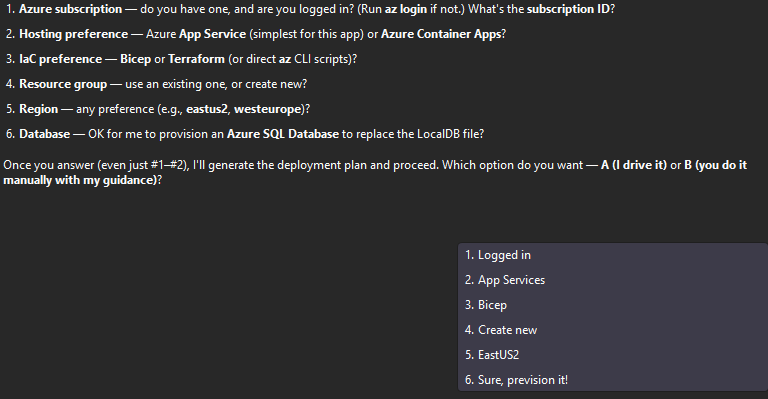
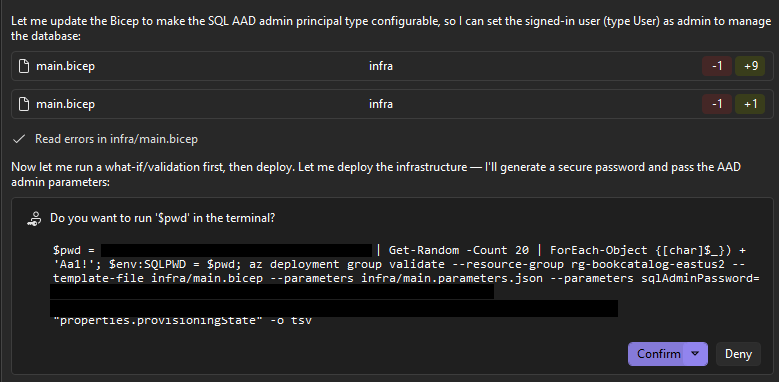

# Chapter 04: Review and deploy to Azure

The runtime upgrade is complete. This chapter uses GitHub Copilot modernization for Azure readiness, identity, secrets, infrastructure, deployment, verification, and cleanup.

The goal is not to watch an agent run Azure CLI commands. The goal is to approve a BookCatalog architecture, prove that each principal has the intended permission, review predicted resource changes, verify the live behavior, and remove every billable resource.

## Learning outcomes

By the end of this chapter, you will:

- execute the secured-credentials modernization scenario;
- review BookCatalog's Azure architecture and generated infrastructure;
- map each principal to Azure RBAC and SQL permissions;
- distinguish Bicep build, deployment validation, what-if, and deployment;
- diagnose identity, Key Vault, SQL, quota, and capacity failures;
- record dated cost assumptions; and
- preserve cleanup evidence.

**Learner artifacts:** an architecture decision, principal-to-permission map, validation/what-if review, deployment result, cost estimate, and cleanup evidence.

> **Generated-output variance:** The screenshots show one recorded run. Prompts, artifacts, line counts, Bicep structure, regions, quotas, task boundaries, and failures can differ. Success is based on the semantic review gates in this chapter, not screenshot equality.

## Prerequisites

From Chapter 03:

- the modernized BookCatalog builds on .NET 10;
- the complete behavior contract passes;
- the schema decision is recorded; and
- the upgrade and generated state are committed.

For Azure:

- an active Azure subscription;
- Azure CLI and Bicep CLI;
- `az login` completed in the intended tenant;
- permission to create resources; and
- permission to create role assignments at the scopes used by the generated infrastructure.

**Contributor alone cannot create Azure role assignments.** Use one of:

- Owner at the relevant scope;
- Contributor plus Role Based Access Control Administrator;
- Contributor plus User Access Administrator; or
- an equivalent narrowly scoped custom role containing `Microsoft.Authorization/roleAssignments/write`.

See the [Azure role-assignment prerequisite guidance](https://learn.microsoft.com/azure/role-based-access-control/role-assignments-steps#step-4-check-your-prerequisites).

## Phase 0: Execute secured-credentials modernization

LocalDB cannot be used by an Azure App Service instance as BookCatalog's durable database. It is a local, per-machine SQL Server dependency attached to a file, while App Service instances need a network-accessible database that survives process and instance changes.

Before provisioning, invoke the secured-credentials scenario in the existing Modernize chat with this prompt:

> Assess BookCatalog for the secured-credentials modernization scenario. Replace the cloud connection-string configuration with Azure Key Vault and `DefaultAzureCredential`. Keep the LocalDB development configuration working. Switch to Guided mode, make no changes during assessment, and pause when the scenario and plan are ready for review.

### Confirm the selected scenario

Do not infer success from a friendly response. Confirm the generated assessment/plan explicitly names:

- plaintext or configuration-held credentials as the source concern;
- Azure Key Vault as the secret/configuration provider;
- `DefaultAzureCredential` and managed identity for Azure authentication;
- the `BookCatalogContext` configuration key; and
- separate local-development and Azure behavior.

If the plan instead proposes hardcoded credentials, an access key in source, or a generic runtime upgrade, correct it before execution.

After the plan passes that review, enter:

> Execute the secured-credentials plan one task at a time. Remain in Guided mode and pause after each task so I can review the package, configuration, and `Program.cs` changes.

At each pause, inspect the diff, build and run locally, and commit the accepted task before asking for the next one. Phase 0 is complete only after the reviewed code changes are applied; generating a plan is not execution.

### Expected changes

Artifact names can vary, but the reviewed result should contain:

| Surface | Expected BookCatalog result |
|---|---|
| Packages | `Azure.Identity`, `Azure.Security.KeyVault.Secrets`, and `Azure.Extensions.AspNetCore.Configuration.Secrets`, or current supported equivalents |
| `Program.cs` | Adds Azure Key Vault configuration with `DefaultAzureCredential`; chooses the user-assigned identity through configured client ID when deployed |
| Local configuration | Development keeps the LocalDB connection in a development-only source and does not require Azure for the normal local lab |
| Azure configuration | `KeyVaultName` and `AZURE_CLIENT_ID` identify resources/identity; the Key Vault provider resolves `ConnectionStrings--BookCatalogContext` to `ConnectionStrings:BookCatalogContext` |
| Generated state | Scenario assessment, plan, task/progress, and reviewed diffs are saved by the product |

Azure object IDs, client IDs, vault names, and resource IDs are identifiers, not authentication secrets. Avoid publishing tenant-specific identifiers unnecessarily, but do not confuse them with passwords, tokens, or keys.

### Review `Program.cs`

Confirm the generated code:

- constructs `DefaultAzureCredential`;
- selects the user-assigned managed identity in Azure;
- uses an HTTPS vault URI built from reviewed configuration;
- fails clearly when required Azure configuration is absent;
- does not silently replace a Key Vault failure with an insecure value; and
- preserves LocalDB only for the Development environment.

Locally, `DefaultAzureCredential` can use your signed-in developer tooling when you deliberately exercise Key Vault. Verify the selected account and token acquisition:

```pwsh
az account show --query "{subscription:id, tenant:tenantId, user:user.name}" --output table
az account get-access-token --resource https://vault.azure.net --query expiresOn --output tsv
```

When running the Key Vault path locally, inspect Azure Identity logs and confirm that the intended developer credential succeeded. In App Service, confirm that the user-assigned managed identity is attached and that `AZURE_CLIENT_ID` matches its client ID.

### Diagnose missing Key Vault access

A successful token request proves authentication, not authorization. For a 403:

```pwsh
$vaultId = az keyvault show --name <vault-name> --query id --output tsv
az role assignment list `
  --assignee-object-id <principal-object-id> `
  --scope $vaultId `
  --include-inherited `
  --output table
```

Check the **object ID** of the identity actually used by `DefaultAzureCredential`, the assignment scope, the role, and propagation time. The application identity needs **Key Vault Secrets User** to read secrets. The identity setting the secret needs **Key Vault Secrets Officer** or another role with write permission. Do not grant Secrets Officer to the runtime application merely to make a read failure disappear.

### Phase 0 review gate

- [ ] Correct scenario and target services are named.
- [ ] Package additions are justified.
- [ ] Local development still runs without Azure.
- [ ] Azure uses managed identity and no SQL password.
- [ ] Missing configuration and authorization fail visibly.
- [ ] The behavior contract passes locally.
- [ ] Generated modernization state and reviewed code are committed.

Only then proceed to provisioning.

## Decide the BookCatalog Azure architecture

Ask the agent:

> Design an Azure deployment for the reviewed BookCatalog app using App Service, Azure SQL Database, user-assigned managed identity, Key Vault, and Application Insights. Generate Bicep, remain in Guided mode, and pause before running any provisioning command.

Review the proposal against these semantic requirements:

| Need | Expected resource/decision | Why |
|---|---|---|
| Web hosting | App Service and a suitable plan | Runs the .NET 10 web application |
| Durable relational data | Azure SQL Database | Replaces LocalDB |
| Workload identity | User-assigned or system-assigned managed identity, used consistently | Authenticates without an application password |
| Configuration/secret teaching pattern | Key Vault with RBAC | Demonstrates an external configuration boundary |
| Monitoring | Application Insights, with supporting workspace if generated | Provides deployment/runtime evidence |
| Authorization | Explicit Key Vault role assignment and SQL database user/permissions | Azure RBAC does not create a SQL user |

Key Vault may be more infrastructure than a tiny catalog needs, especially because a passwordless SQL connection string contains identifiers rather than a SQL credential. It remains in this course to teach the supported external-configuration and managed-identity pattern. Record that trade-off.

One recorded run summarized these dependencies:


## Map principals before deployment

Complete and approve this map:

| Principal | Purpose | Minimum expected permission |
|---|---|---|
| Learner identity | Provision resources and create Azure role assignments | Resource deployment permission plus role-assignment permission at the required scope |
| Application managed identity | Read Key Vault configuration and authenticate to Azure SQL | Key Vault Secrets User plus a contained SQL database user with normal data permissions |
| SQL deployment/administrator identity | Create database users and apply reviewed schema | Microsoft Entra administrator/deployment access plus required schema permissions |
| Runtime database user | Read and modify normal BookCatalog data | Least-privilege DML permissions; no routine schema-management role |

Keep these permission systems separate:

- **Key Vault Secrets User** reads secret values.
- **Key Vault Secrets Officer** manages secret values; it does not grant Azure role-assignment rights.
- **Azure RBAC role assignments** grant Azure resource/data-plane roles at a scope.
- **Azure SQL permissions** are granted inside the database after the managed identity exists.

The recorded run granted runtime DDL to simplify automatic database creation. That is broad. For production, apply reviewed EF migrations with the deployment identity and restrict the runtime database user to ordinary application operations.

## Run an RBAC preflight

Set the intended subscription, inspect your principal, and list inherited assignments before generating resources:

```pwsh
$subscriptionId = az account show --query id --output tsv
$principalId = az ad signed-in-user show --query id --output tsv
$scope = "/subscriptions/$subscriptionId"

az role assignment list `
  --assignee-object-id $principalId `
  --scope $scope `
  --include-inherited `
  --query "[].{role:roleDefinitionName, scope:scope}" `
  --output table
```

If you are using a service principal or federated identity, obtain that principal's object ID instead of calling `az ad signed-in-user`. Confirm both resource creation and role-assignment capability before deployment; a Contributor result alone is insufficient.

## Review generated infrastructure

Provide the agent only the subscription, region, hosting choice, infrastructure language, resource-group choice, and database decision it needs. Do not paste passwords or tokens into chat.



The generated Bicep may be split across modules or emitted as one file. Review:

- deterministic, collision-resistant names;
- allowed regions and SKUs;
- HTTPS-only App Service;
- managed identity attachment;
- Key Vault RBAC mode and soft-delete behavior;
- Azure SQL Microsoft Entra administration;
- no runtime SQL password;
- app settings that contain references/identifiers rather than credentials;
- Application Insights connection;
- role-assignment scope and principal IDs;
- secure deployment parameters; and
- outputs that do not expose sensitive values.


`az bicep build --file infra\main.bicep` checks Bicep compilation. Treat warnings as review findings, not cosmetic output.

## Validate, preview, then deploy

These commands serve different purposes and belong in this order:

```pwsh
az group create `
  --name <resource-group> `
  --location <region>

az deployment group validate `
  --resource-group <resource-group> `
  --template-file infra\main.bicep `
  --parameters @infra\main.parameters.json

az deployment group what-if `
  --resource-group <resource-group> `
  --template-file infra\main.bicep `
  --parameters @infra\main.parameters.json

az deployment group create `
  --name bookcatalog `
  --resource-group <resource-group> `
  --template-file infra\main.bicep `
  --parameters @infra\main.parameters.json
```

- **validate** checks whether the deployment is valid.
- **what-if** predicts resource changes without applying them.
- **create** performs the deployment.

Creating a resource group does not provision the BookCatalog application, but group-scope validation requires the group to exist. If you selected an existing dedicated group, verify its location and contents instead of creating it.

Before `create`, save:

- validation success or actionable warnings;
- the what-if create/modify/delete list;
- unexpected replacements or deletions;
- role assignments and scopes;
- selected regions/SKUs; and
- the cost-impacting resources.



Validation is not a what-if dry run. A successful validation also does not prove quota, capacity, runtime identity, or SQL authorization.

## Treat failures as case studies

The recorded course run encountered App Service quota, a missing SQL identity property, and regional capacity. These failures are **possible**, not required milestones.

When a failure occurs:

1. capture the exact operation, resource, code, and correlation ID;
2. decide whether it is template logic, permissions, quota, capacity, or propagation;
3. make the smallest reviewed correction;
4. rerun `validate`;
5. rerun `what-if`; and
6. deploy only after the predicted changes are acceptable.

Do not send a bare "Continue and debug" if you intend to remain in Guided mode. Use:

> Diagnose this deployment failure, propose the smallest correction, remain in Guided mode, and pause before changing files or running another Azure command.

Role assignments can take time to propagate. Waiting is appropriate only after verifying the correct principal, role, and scope; it is not a substitute for authorization diagnosis.

## Apply schema with the correct identity

If Chapter 03 retained `EnsureCreated()`, keep calling it a disposable-lab exception. For a production-shaped deployment:

1. generate and review the EF Core migration;
2. apply it with the SQL deployment/administrator identity;
3. create the managed-identity database user; and
4. grant only the runtime data permissions BookCatalog needs.

Azure RBAC does not grant SQL `SELECT`, `INSERT`, `UPDATE`, or `DELETE`, and an Azure SQL user does not grant Key Vault access.

## Deploy and verify

After infrastructure and schema review, deploy the published application using the generated, reviewed command. Verify more than HTTP 200:

- App Service reports healthy startup;
- Key Vault access succeeds through the intended managed identity;
- Azure SQL authentication contains no SQL password;
- the seeded active catalog appears once;
- unknown IDs return 404;
- validation messages appear;
- create, edit, and delete pass;
- edit preserves `CreatedDate`;
- anti-forgery rejection remains active;
- User-Agent behavior is retained or intentionally changed; and
- telemetry receives a request without logging credentials.

Run the same HTTP characterization script against the public HTTPS URL:

```pwsh
.\shared-legacy-app\scripts\Test-BookCatalogBehavior.ps1 `
  -BaseUrl https://<your-app>.azurewebsites.net
```


## Record cost assumptions

Prices vary by date, agreement, region, currency, tier, and usage. Use the [Azure pricing calculator](https://azure.microsoft.com/pricing/calculator/) immediately before deployment.

The recorded course example was estimated in **May 2026**, **Central US**, **USD**, for one month of an **F1 App Service plan**, one **Azure SQL Standard S0 database**, a low number of **Key Vault operations**, and negligible **Application Insights ingestion**. Its roughly **US$15/month** SQL estimate was a dated example, not a quote or cap.

Record your own:

| Assumption | Value |
|---|---|
| Estimate date | |
| Region and currency | |
| App Service tier and hours | |
| Azure SQL tier, storage, and uptime | |
| Key Vault operations | |
| Monitoring ingestion/retention | |
| Tax, support, and negotiated discounts | |
| Estimated total | |

Quota and regional capacity failures are possible even when the calculator shows a price.

## Clean up and preserve evidence

Delete the dedicated course resource group when verification is complete:

```pwsh
az group delete --name <resource-group> --yes
az group exists --name <resource-group>
# false
```

Do not use `--no-wait` when capturing cleanup evidence; wait until deletion finishes. Save:

- the resource-group name;
- deletion timestamp;
- `az group exists` result;
- any separately scoped role assignment or resource that was not in the group; and
- the final calculator estimate.

Deleting a resource group is destructive. Verify that it contains only course resources before approving the command.

## Final review gate

- [ ] Phase 0 secured-credentials scenario was executed and reviewed.
- [ ] Local and Azure configuration paths are understood.
- [ ] Principal-to-permission map is complete.
- [ ] RBAC preflight proves role-assignment capability.
- [ ] Generated infrastructure meets the semantic architecture requirements.
- [ ] Bicep build, deployment validation, and what-if were reviewed separately.
- [ ] Deployment behavior contract passes.
- [ ] Cost assumptions are dated and scoped.
- [ ] Cleanup evidence shows the resource group no longer exists.

## Transfer exercise

How would the architecture and approval flow change if a platform team owned role assignments, a database team applied migrations, production required zero downtime, and Key Vault already existed at a shared scope? Identify which artifacts cross team boundaries and who approves each one.

## References

- [GitHub Copilot modernization for Azure](https://learn.microsoft.com/dotnet/azure/migration/appmod/overview)
- [Install the modernization experience](https://learn.microsoft.com/dotnet/azure/migration/appmod/install)
- [Key Vault configuration for ASP.NET Core](https://learn.microsoft.com/aspnet/core/security/key-vault-configuration?view=aspnetcore-10.0)
- [App Service managed identity with Azure SQL](https://learn.microsoft.com/azure/app-service/tutorial-connect-msi-sql-database)
- [Azure SQL passwordless migration](https://learn.microsoft.com/azure/azure-sql/database/azure-sql-passwordless-migration)
- [Bicep deployment preflight](https://learn.microsoft.com/azure/azure-resource-manager/bicep/deploy-preflight)
- [ARM what-if](https://learn.microsoft.com/azure/azure-resource-manager/templates/deploy-what-if)
- [Azure SQL cost management](https://learn.microsoft.com/azure/azure-sql/database/cost-management)
- [Azure pricing calculator](https://azure.microsoft.com/pricing/calculator/)

**[Return to the course overview](../README.md)**
