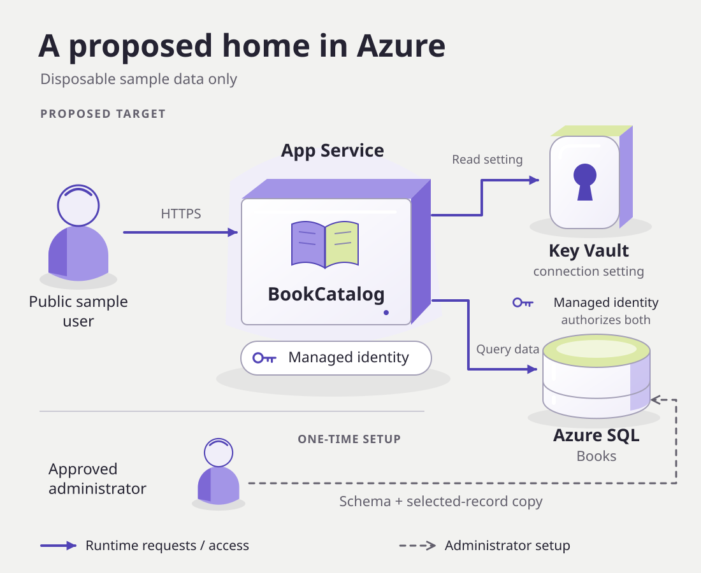

<a id="chapter-04-prepare-for-azure"></a>
# Chapter 07: Assess and plan for Azure

<!-- repo-only:start -->
> [!TIP]
> **Prefer the web experience?** [Open this page on the course website](https://microsoft.github.io/dotnet-modernization-for-beginners/#/04-cloud) for the best reading experience and navigation.
<!-- repo-only:end -->

Your upgraded app runs locally. Now use Visual Studio's Azure modernization workflow to find what must change before it can run in Azure.

Open `shared-legacy-app\BookCatalog.sln`, containing the app you upgraded in Chapter 06.
The result of this chapter is an Azure assessment and an edited migration plan.
**Don't create Azure resources or deploy the app in this chapter.**

Use the Visual Studio installation and Copilot account from Setup.
You don't need Azure CLI, Node, or an Azure subscription for this planning path.

## What changes when the app moves?

LocalDB runs on your Windows machine. Uploading the web application wouldn't move that database with it.
The cloud app needs its own database and connection string.
That setting identifies the database server, database, and authentication method.

Use these components as the proposed target:

| Component | Responsibility |
| --- | --- |
| Azure App Service on Linux | Run the .NET 10 web app while Azure manages the servers and operating system |
| Azure SQL | Store the cloud catalog in an Azure-hosted SQL database |
| Azure Key Vault | Store secrets and sensitive settings. In this design, it holds the database connection string. |
| Managed identity | Give the app an Azure identity it can use without storing an application password |

The managed identity still needs permission to read Key Vault settings and access the database.



## Ask the agent for cloud-readiness findings

Stop debugging. Open a new Copilot Chat for the Azure workflow.

Start the process from Copilot Chat with this request:

```text
@Modernize Migrate to Azure.
Assess this upgraded BookCatalog application only.
Do not change application code, sign in to Azure, create resources, or deploy.
Identify the assessment report and configuration locations.
Stop after assessment.
```

This is the Azure workflow, not another .NET framework upgrade.

Approve requests to inspect the local application for assessment.

If the tool requires Azure sign-in or resource creation, stop and record the exact message.
Those actions aren't part of this chapter.

## Compare the report with the real application

<a id="your-decision-what-finding-changes-the-plan"></a>
Open the report from the assessment results.
If you can't find it, ask the agent to show the report's path and open it.
Look for **Application Information**, **Issue Summary**, and **Issues**, or equivalent headings.
First check that the report names your upgraded BookCatalog project.

Expand one issue about configuration, hosting, or database access.
Read its explanation and recommended migration task.
Identify the application setting or code that the task would change.

For example, a local database connection needs a cloud database and a different access configuration.
If your report doesn't identify a LocalDB issue, ask the agent how the current connection will work on App Service.
Keep its answer separate from the report's actual findings.

Report criticality labels such as **Mandatory**, **Potential**, and **Optional** help you review findings.
They aren't instructions to execute every suggested task.

## Choose a target with a reason

Use **App Service on Linux** for the Azure design.
It runs .NET 10 web applications without requiring you to manage a server.

Visual Studio documentation places assessment configuration under `.appmod\.appcat`, often in `assessment-config.json`.
Ask the modernization agent to open the configuration file and show the selected target.

If the target isn't `AppService.Linux`, ask the agent to select that target and rerun the assessment.
Check that the new report names App Service on Linux.

## Generate a migration plan without executing it

Choose one recommended migration task from your report and copy its title.
Use chat to request a plan. Don't select **Run Task** if that action would immediately change the application.

Keep the planning-only boundary explicit. Replace the placeholder below with the task's actual title:

```text
@Modernize Prepare the plan for <actual-migration-task-title>.
Plan for BookCatalog on App Service on Linux with Azure SQL.
Include the configuration and identity dependencies the task needs.
Identify the generated plan and progress files.
Don't change application code, sign in to Azure, create resources, or deploy.
Stop when the plan is ready for review.
```

Ask the agent to open the files it created.
Visual Studio documentation describes `.appmod\.migration\plan.md` and `progress.md`.
Use the paths from your run. These aren't the framework-upgrade files under `.github\upgrades`.

If the tool starts execution instead of offering a planning boundary, stop it and inspect the pending changes.
Don't approve code changes to make the instructions appear to work.

## Edit and reconcile the cloud plan

Open the Azure migration `plan.md` (not the .NET upgrade plan from Chapter 05).

Future deployment needs its own approval.
A **subscription** sets billing and access boundaries for Azure resources.
A **resource group** keeps related resources together so you can manage or delete them as a group.
A **region** is the geographic location where Azure runs those resources.
The cleanup owner is responsible for deleting the lab resources.

Find the configuration or validation section and add these requirements:

```text
Keep local BookCatalog development working without Azure access.
Keep LocalDB for local runs. Use Azure SQL for the proposed cloud deployment.
Before any future deployment, require separate approval for the
subscription, dedicated resource group, region, budget, and cleanup owner.
Create the cloud schema from the EF Core model and use demo seed data.
After deployment, check the app by adding and editing a new sample book.
```

Save the file and ask:

```text
@Modernize Read the requirements I added to the Azure migration plan.
Update its configuration, deployment, and validation steps to include them.
Show the changed steps.
Leave unrun work pending. Don't change application code, create Azure resources, or deploy.
```

Read the changed sections.
Check that the plan keeps local runs on LocalDB and uses the EF Core model to create the proposed cloud schema.
Deployment must still require separate approval.

## Finish the required course

You now have the Azure assessment and a migration plan that includes your saved requirements.

You've used the modernization agent to assess, plan, and upgrade an application, then prepare its cloud plan.
Keep the reports and plans so you can review the decisions with your team.

**[Back to course overview](../README.md)**

<a id="earlier-deployment-links"></a>
<a id="check-tools-access-and-costs-first"></a>
<a id="prepare-the-application-explicitly"></a>
<a id="produce-a-schema-from-your-application"></a>
<a id="review-the-infrastructure"></a>
<a id="your-review-what-can-each-identity-do"></a>
<a id="provision-the-dedicated-lab"></a>
<a id="apply-the-schema-and-application-permissions"></a>
<a id="publish-your-learner-application"></a>
<a id="delete-the-dedicated-lab-group"></a>

## Reference

- [Visual Studio Azure assessment and migration workflow](https://learn.microsoft.com/dotnet/azure/migration/appmod/quickstart?pivots=visualstudio)
- [Assessment configuration and report interpretation](https://learn.microsoft.com/dotnet/azure/migration/appmod/working-with-assessment)
- [Optional Azure support files](../examples/azure/README.md)
