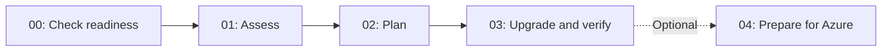

# .NET Modernization for Beginners

Give a working legacy app a new foundation.

Use GitHub Copilot to upgrade **BookCatalog**, an ASP.NET MVC 5 application, from .NET Framework 4.8 to .NET 10. A catalog maintainer uses it to add and edit books, inspect details, and keep inactive books out of the main list. Your job is to keep those behaviors working while changing the implementation.

This workshop is for developers who know C#, ASP.NET, Visual Studio, NuGet, and basic Git. You do not need previous experience with the upgrade agent.

**[Start the workshop: check your setup](00-introduction/README.md)** · [Run the legacy sample only](shared-legacy-app/README.md) · [Inspect the completed reference](examples/modernized/README.md)

<a id="-what-youll-learn"></a>
## What you'll learn

You will run an assessment, turn its findings into decisions, and review a plan before allowing code changes. Then you will inspect generated diffs and check whether the modernized app still behaves as expected.

By the end of the core path, you should be able to:

- Explain why a compatibility finding and its business priority are different.
- Change an upgrade plan with a reason and a way to test the result.
- Compare application behavior before and after an upgrade.
- Resume work from a saved checkpoint and make a small independent change.

The optional Azure extension covers cloud readiness, managed identity, deployment, and cleanup. It follows the local upgrade. **You do not need Azure access to complete the core workshop**.

<a id="-prerequisites"></a>
## Prerequisites

The learner path uses **Windows and Visual Studio 2026**. The legacy web project needs ASP.NET web build tools, .NET Framework 4.8 targeting tools, IIS Express, and SQL Server LocalDB. The modernized app needs a stable .NET 10 SDK. You also need Git and a GitHub account with Copilot access.

[Chapter 00](00-introduction/README.md#check-before-installing) provides checks, acceptable results, and installation guidance only for missing requirements. Other Copilot environments exist, but they do not make this legacy Windows project a macOS/Linux lab.

## Which Copilot tool are we using?

**GitHub Copilot upgrade** handles the .NET version upgrade. In Visual Studio, you still start it through **Modernize** or `@Modernize`. **GitHub Copilot modernization** provides the Azure migration capabilities used in the optional extension.

The agent can assess, plan, and edit. You decide the strategy, authorize the work, and verify the result. A green build is evidence about compilation, not proof that application behavior survived.

<a id="-course-structure"></a>
## Course structure



| Chapter | What you do | Evidence before moving on |
| --- | --- | --- |
| [00: Introduction](00-introduction/README.md) | Check your tools, run the app, and save a baseline | A working legacy app and a learner branch |
| [01: Assessment](01-assessment/README.md) | Trace findings into real source | Finding, priority, and handling decisions |
| [02: Planning](02-planning/README.md) | Choose the EF approach and define execution groups | A reviewed plan with behavior checks |
| [03: Upgrade execution](03-upgrade-execution/README.md) | Review changes and repeat the baseline checks | A working .NET 10 app and an independent modification |
| [04: Azure extension](04-cloud/README.md) | Prepare identity/configuration, deploy, and clean up | Persisted cloud behavior and cleanup evidence |

## Work on your own copy

Use the **Code** menu in the repository that hosts your workshop. Copy its clone URL.

Replace `<workshop-repository-url>` below with that URL. Run the commands in your projects directory:

```powershell
git clone <workshop-repository-url> dotnet-modernization-for-beginners
cd dotnet-modernization-for-beginners
```

Follow the chapters in order through Chapter 03. The console example in Chapter 00 is an optional warm-up. BookCatalog is the continuing project.

Your output may differ from the recorded screenshots. Counts, package versions, task boundaries, and chat wording change. Compare the meaning of your artifacts and the application's behavior, not the number of messages the agent sends.

The workshop uses disposable sample data and a **separate modernized database**. It does not teach migration of an existing business database. Keep the legacy database intact.

## Samples and help

- [Legacy sample quickstart](shared-legacy-app/README.md)
- [Completed reference and its intentional differences](examples/modernized/README.md)
- [Behavior checks and validation boundaries](docs/validation.md)
- [Recorded assessment example](examples/assessments/README.md)
- [GitHub Copilot upgrade documentation](https://learn.microsoft.com/dotnet/core/porting/github-copilot-upgrade/overview)
- [GitHub Copilot modernization for Azure](https://learn.microsoft.com/dotnet/azure/migration/appmod/overview)
- [Report a course issue](https://github.com/microsoft/dotnet-modernization-for-beginners/issues)

## Contributing

Edit the chapter READMEs, not generated website content. See [the website guide](webpage/README.md) for local preview and [validation](docs/validation.md) for checks. Historical notes are under `docs/history/`. They are not learner instructions.

## License

MIT. See [LICENSE](LICENSE). Third-party font and tool licenses remain with their respective assets.
