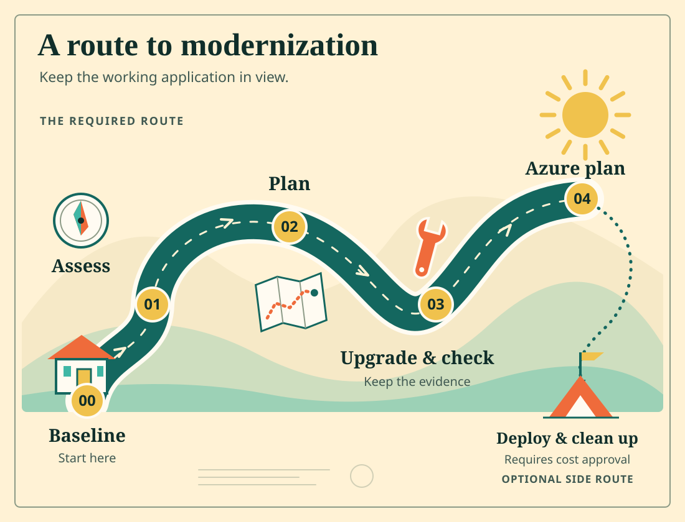

# .NET Modernization for Beginners

Modernize a legacy .NET app without losing the behavior or records its users need.

Our sample, BookCatalog, lets a catalog editor add, inspect, edit, and remove books. Its main list hides inactive books and sorts active books by title.

In this self-paced course, you will upgrade the application from .NET Framework 4.8 to .NET 10. You will then assess and plan its move to Azure. Deployment is optional.

You will direct the agent through **assess, decide, plan, change, and verify**. The result is your working application, two preserved records, and decisions you can explain.

This course assumes C#, basic ASP.NET MVC, Visual Studio, NuGet, and basic Git knowledge. You do not need previous modernization experience.

[**Start: check your setup**](00-introduction/README.md) · [Run the legacy sample only](shared-legacy-app/README.md) · [Run the completed reference](examples/modernized/README.md)

<a id="-what-youll-learn"></a>
## What you'll learn

By the end of the required course, you should be able to:

- Establish a behavior baseline before authorizing changes.
- Trace an assessment finding to source and separate compatibility from business priority.
- Edit requirements and show their effect on the agent's plan.
- Compare upgrade options and repair a weak validation step.
- Review generated changes and check the same selected records in a separate database.
- Resume interrupted work and make a small independent change.
- Assess Azure readiness and revise a migration plan without creating resources.

The optional deployment adds cloud behavior, data-preservation, and cleanup checks. **You do not need an Azure subscription to complete the required course.**

<a id="-prerequisites"></a>
## Prerequisites

Use **Windows, Visual Studio 2026, and PowerShell**. The legacy app needs ASP.NET web build tools, .NET Framework 4.8 targeting tools, IIS Express, and SQL Server LocalDB.

You also need a stable .NET 10 SDK, Git, and a GitHub account with Copilot access.

[Chapter 00](00-introduction/README.md#check-before-installing) explains how to check existing tools before installing anything. Azure CLI and Node are not prerequisites for the required lessons.

## Which Copilot tool are we using?

**GitHub Copilot upgrade** handles the framework upgrade. In Visual Studio, start through **Modernize** or `@Modernize`.

**GitHub Copilot modernization** handles Azure migration. Chapter 04 uses Visual Studio's **Modernize > Migrate to Azure** workflow.

The agent can assess, plan, and edit. You choose the strategy, authorize changes, and verify results. A successful build does not prove that behavior or data survived.

<a id="-course-structure"></a>
## Course structure



| Chapter | What you do | Evidence before moving on |
| --- | --- | --- |
| [00: Introduction](00-introduction/README.md) | Run BookCatalog and select two records to preserve | Working baseline, actual record IDs, and learner branch |
| [01: Assessment](01-assessment/README.md) | Trace a finding and edit application requirements | Reviewed assessment linked to your baseline |
| [02: Planning](02-planning/README.md) | Compare EF options, revise the plan, and export selected records | Requirement-to-check links and a source snapshot |
| [03: Upgrade execution](03-upgrade-execution/README.md) | Review changes, copy records, and check behavior | Working .NET 10 app, matching stored values, and an independent change |
| [04: Azure planning](04-cloud/README.md) | Assess a target and revise its migration plan | Reviewed Azure assessment and plan, without deployment |

Keep one [learner record](docs/learner-record.md) through all five chapters. The [optional deployment lab](04-cloud/deployment.md) follows Chapter 04.

## Work on your own copy

Use the **Code** menu in the repository that hosts your course. Copy its clone URL.

Replace `<course-repository-url>` with that URL. Run this in your projects directory:

```powershell
git clone <course-repository-url> dotnet-modernization-for-beginners
if ($LASTEXITCODE -ne 0) { throw "Clone failed." }
Set-Location dotnet-modernization-for-beginners
```

Follow Chapters 00 through 04 in order. The console example is an optional warm-up. BookCatalog is the continuing project.

Your output can differ from recorded screenshots. Counts, package versions, task boundaries, and chat wording change. Compare the meaning of the artifacts and the application's behavior.

Use sample data only. A supplied .NET helper copies two selected records into a separate modernized database. Reseeding a database does not copy those records.

The legacy database stays unchanged. This small copy exercise is not a production backup, schema migration, or cutover procedure.

## Samples and help

- [Legacy sample quickstart](shared-legacy-app/README.md)
- [Completed reference and intentional differences](examples/modernized/README.md)
- [Learner record](docs/learner-record.md)
- [Recorded assessment example](examples/assessments/README.md)
- [Optional instructor companion](docs/instructor-guide.md)
- [GitHub Copilot upgrade documentation](https://learn.microsoft.com/dotnet/core/porting/github-copilot-upgrade/overview)
- [GitHub Copilot modernization for Azure](https://learn.microsoft.com/dotnet/azure/migration/appmod/overview)
- [Report a course issue](https://github.com/microsoft/dotnet-modernization-for-beginners/issues)

## Contributing

Edit chapter READMEs, not generated website content. See [writing guidance](docs/writing.md), [maintainer validation](docs/validation.md), and [website preview instructions](webpage/README.md).

Historical notes under `docs/history/` are not learner instructions. A local preview does not publish the course.

## License

MIT. See [LICENSE](LICENSE). Third-party font and tool licenses remain with their respective assets.
