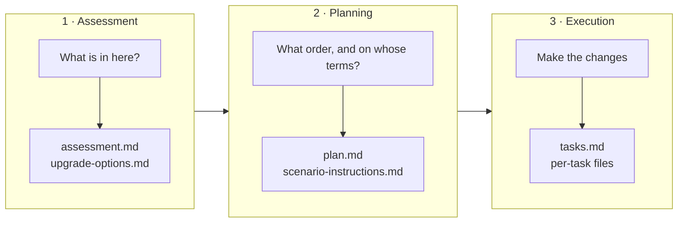

# .NET Modernization for Beginners

Upgrade a real ASP.NET MVC 5 and Entity Framework 6 application from .NET Framework 4.8
to .NET 10, then migrate it to Azure — using GitHub Copilot modernization to do the work
while you stay in control.

You'll spend most of this course with your hands on the keyboard, driving the agent.

**Total time: about 5 hours 45 minutes.** You can stop after any chapter.

## Who this is for

You already know C#, ASP.NET, Git, and NuGet. You have never run a structured
modernization workflow. That's exactly the right starting point.

## What you'll learn

GitHub Copilot modernization works in three stages: **assessment**, **planning**, and
**execution**. This course teaches you what each stage does, why you run them separately,
and — most importantly — how to change what the agent decides at every one of them.

Diagram: the three modernization stages and the artifacts each one writes.



## The course

| Chapter | You'll end up with | Time |
|---|---|---|
| [00 · Set up and first run](00-setup/README.md) | An assessment you generated and read | ~30 min |
| [01 · Assessment](01-assessment/README.md) | A corrected assessment with your own context in it | ~45 min |
| [02 · Planning](02-planning/README.md) | A default plan and your plan, side by side | ~45 min |
| [03 · Execution](03-execution/README.md) | An upgraded app, one recovered failure, and the tests the codebase never had | ~60 min |
| [04 · Teaching the agent](04-teaching-the-agent/README.md) | An instruction file containing your own diff | ~30 min |
| [05 · Migrating to Azure](05-azure-migration/README.md) | Agent-generated Azure code and Bicep | ~60 min |
| [06 · Deploy and validate](06-deploy-and-validate/README.md) | A validated sandbox deployment, then deleted | ~45 min |
| [07 · Bring your own app](07-your-own-app/README.md) | A scoped plan for an app you care about | ~30 min |

## Start here

1. Check you have [what you need](docs/ENVIRONMENT.md).
2. Clone the repository and run preflight:

   ```powershell
   git clone https://github.com/codemillmatt/dotnet-modernization-for-beginners.git
   Set-Location dotnet-modernization-for-beginners
   .\scripts\Test-Prerequisites.ps1
   ```

3. Go to [Chapter 00](00-setup/README.md).

## Which tools you need

This course uses **Visual Studio on Windows**. That's where GitHub Copilot modernization
is most complete today.

A **VS Code version of this course is coming soon.** The agent already works in VS Code
and in the Copilot CLI — the artifacts and the workflow are the same, only the UI differs.
See [working on other surfaces](docs/CROSS-SURFACE.md).


Good news on cost: **Copilot Free works** starting with Visual Studio 2026 version 18.1.

## If you get stuck

Nothing you generate will look exactly like the examples here — agent output varies with
tool version, SDK, and your own answers. That's expected and fine. See
[when your output differs](docs/OUTPUT-DIFFERS.md) and
[troubleshooting](docs/TROUBLESHOOTING.md).

Every chapter has a known-good checkpoint you can jump to:

```powershell
.\scripts\Reset-Course.ps1 -Checkpoint 03-modernized
```

Checkpoints are read-only reference states. The script copies one into an ignored `work/`
folder, so it can never overwrite what you've done. See
[checkpoint contents](checkpoints/README.md).

## Reference

- [What you need to run this](docs/ENVIRONMENT.md)
- [Prompt and file cheat sheet](docs/CHEAT-SHEET.md)
- [Troubleshooting](docs/TROUBLESHOOTING.md)
- [Reading the assessment](docs/TECHNICAL-GUIDANCE.md)
- [Working safely with the agent](docs/SAFE-WORKFLOW.md)
- [Proving behavior didn't change](docs/VALIDATION.md)
- [Lab versus production](docs/PRODUCTION-READINESS.md)
- [Other surfaces: VS Code and CLI](docs/CROSS-SURFACE.md)
- [Glossary](docs/GLOSSARY.md)

## Official documentation

- [GitHub Copilot modernization overview](https://learn.microsoft.com/dotnet/core/porting/github-copilot-app-modernization/overview)
- [Predefined Azure migration tasks](https://learn.microsoft.com/dotnet/azure/migration/appmod/predefined-tasks)
- [.NET porting guidance](https://learn.microsoft.com/dotnet/core/porting/)
- [ASP.NET MVC migration guidance](https://learn.microsoft.com/aspnet/core/migration/mvc)
- [EF6 to EF Core porting guidance](https://learn.microsoft.com/ef/efcore-and-ef6/porting/)

## Help and contributions

- [Open an issue](https://github.com/codemillmatt/dotnet-modernization-for-beginners/issues)
- Report agent bugs at [dotnet/modernize-dotnet](https://github.com/dotnet/modernize-dotnet)
- Read [CONTRIBUTING.md](CONTRIBUTING.md) and [SECURITY.md](SECURITY.md)

MIT licensed; see [LICENSE](LICENSE).
