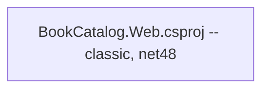

# Model assessment: BookCatalog

This is a **model artifact**, not captured output. It mirrors the section structure,
vocabulary, and level of detail a real `assessment.md` uses, applied to the BookCatalog
sample. Your run will produce different counts, different wording, and possibly different
section names. See [when your output differs](../../../docs/OUTPUT-DIFFERS.md).

Use it to calibrate what "good" looks like before you read your own report — not as an
answer key.
{: .note }

---

## Projects and dependencies analysis

An overview of the projects and their dependencies in the context of upgrading to
.NETCoreApp,Version=v10.0.

### Executive Summary

#### Highlevel Metrics

| Metric | Count | Status |
| :--- | :---: | :--- |
| Total Projects | 1 | All require upgrade |
| Total NuGet Packages | 6 | 4 incompatible, 2 upgrade recommended |
| Total Code Files | 14 | |
| Total Code Files with Incidents | 9 | |
| Total Lines of Code | 633 | |
| Total Number of Issues | 24 | |
| Estimated LOC to modify | 120+ | at least 19% of codebase |

#### Projects Compatibility

| Project | Target Framework | Difficulty | Package Issues | API Issues | Est. LOC Impact | Description |
| :--- | :---: | :---: | :---: | :---: | :---: | :--- |
| `BookCatalog.Web\BookCatalog.Web.csproj` | net48 | 🔴 High | 4 | 20 | 120+ | AspNetMvc, Sdk Style = False |

#### Package Compatibility

| Status | Count | Percentage |
| :--- | :---: | :---: |
| ✅ Compatible | 0 | 0.0% |
| ⚠️ Incompatible | 4 | 66.7% |
| 🔄 Upgrade Recommended | 2 | 33.3% |
| ***Total NuGet Packages*** | ***6*** | ***100%*** |

#### API Compatibility

| Category | Count | Impact |
| :--- | :---: | :--- |
| 🔴 Binary Incompatible | 12 | High - Require code changes |
| 🟡 Source Incompatible | 6 | Medium - Needs re-compilation and potential conflicting API error fixing |
| 🔵 Behavioral change | 2 | Low - Behavioral changes that may require testing at runtime |
| ✅ Compatible | 61 | |
| ***Total APIs Analyzed*** | ***81*** | |

### Aggregate NuGet packages details

| Package | Current Version | Suggested Version | Description |
| :--- | :---: | :---: | :--- |
| Microsoft.AspNet.Mvc | 5.2.9 | — | No .NET 10 equivalent. Replace with the ASP.NET Core MVC framework reference |
| Microsoft.AspNet.Razor | 3.2.9 | — | Superseded by the Razor support built into ASP.NET Core |
| Microsoft.AspNet.WebPages | 3.2.9 | — | No .NET 10 equivalent. Functionality is absorbed by ASP.NET Core |
| Microsoft.Web.Infrastructure | 2.0.0 | — | `System.Web` infrastructure shim. Not applicable on .NET 10 |
| EntityFramework | 6.4.4 | 6.5.1 | EF6 runs on .NET 10. Porting to EF Core is a separate decision |
| Newtonsoft.Json | 13.0.3 | 13.0.4 | Compatible. Whether to move to `System.Text.Json` is a separate decision |

### Top API Migration Challenges

#### Technologies and Features

| Technology | Issues | Percentage | Migration Path |
| :--- | :---: | :---: | :--- |
| ASP.NET Framework (System.Web) | 14 | 70.0% | Legacy ASP.NET Framework APIs (`System.Web.*`) that don't exist in ASP.NET Core due to architectural differences. Migrate to ASP.NET Core equivalents, or consider the `System.Web.Adapters` package for incremental migration |
| Legacy Configuration System | 4 | 20.0% | XML-based `Web.config` configuration replaced by `Microsoft.Extensions.Configuration`. Migrate to `appsettings.json` and the options pattern |
| Entity Framework 6 | 2 | 10.0% | EF6 is supported on .NET 10, but `Database.SetInitializer` and the `DbContext` connection-string constructor behave differently. EF Core is a separate migration with its own risk profile |

#### Most Frequent API Issues

| API | Count | Percentage | Category |
| :--- | :---: | :---: | :--- |
| `T:System.Web.Mvc.Controller` | 5 | 25.0% | Binary Incompatible |
| `T:System.Web.Mvc.ActionResult` | 4 | 20.0% | Binary Incompatible |
| `T:System.Web.HttpApplication` | 2 | 10.0% | Binary Incompatible |
| `P:System.Web.HttpContext.Current` | 2 | 10.0% | Source Incompatible |
| `T:System.Web.Routing.RouteCollection` | 2 | 10.0% | Binary Incompatible |
| `M:System.Data.Entity.Database.SetInitializer` | 2 | 10.0% | Behavioral change |
| `T:System.Configuration.ConfigurationManager` | 2 | 10.0% | Source Incompatible |
| `T:System.Web.Mvc.FilterCollection` | 1 | 5.0% | Binary Incompatible |

### Projects Relationship Graph

Legend: 📦 SDK-style project · ⚙️ Classic project

Diagram: BookCatalog is a single classic project with no project-to-project references.

### Project Details

#### `BookCatalog.Web\BookCatalog.Web.csproj`

- **Current Target Framework:** net48
- **Proposed Target Framework:** net10.0
- **SDK-style:** False
- **Project Kind:** AspNetMvc
- **Dependencies:** 0
- **Dependants:** 0
- **Number of Files:** 14
- **Number of Files with Incidents:** 9
- **Lines of Code:** 633
- **Estimated LOC to modify:** 120+ (at least 19% of the project)

#### Notable incidents

| Issue ID | Severity | Story Points | File | What it is |
| :--- | :---: | :---: | :--- | :--- |
| Project.0001 | Mandatory | 3 | `BookCatalog.Web.csproj` | Classic (non-SDK) project format must be converted |
| Project.0002 | Mandatory | 1 | `BookCatalog.Web.csproj` | Target framework must change from net48 to net10.0 |
| Project.0003 | Mandatory | 2 | `packages.config` | Must be migrated to `PackageReference` |
| Api.0001 | Mandatory | 5 | `Controllers/BooksController.cs` | Derives from `System.Web.Mvc.Controller`, which does not exist on .NET 10 |
| Api.0002 | Potential | 1 | `Controllers/BooksController.cs` | `HttpContext.Request.UserAgent` — `HttpContext` is source incompatible |
| Api.0001 | Mandatory | 3 | `Global.asax.cs` | `HttpApplication` and the `RouteConfig`/`FilterConfig` registration model have no .NET 10 equivalent |
| Api.0003 | Information | 2 | `Models/ApplicationDbContext.cs` | `Database.SetInitializer` behaves differently; seeding must move to startup |
| Config.0001 | Mandatory | 3 | `Web.config` | Connection strings and app settings must move to `appsettings.json` |

---

## How to read this

Three things are worth noticing, and they're the same three in every report.

**Severity is the agent's estimate of effort, not your estimate of risk.**
`Database.SetInitializer` is marked Information — the lowest severity in the scale — and
it's the finding most likely to silently change what data your users see. Severity ranks
how hard the change is to make, not how badly it hurts if you get it wrong.

**"Compatible" doesn't mean "keep it."** Newtonsoft.Json is fully compatible. Whether it
stays is still a decision you make, and the report is not making it for you.

**Nothing here mentions tests.** BookCatalog has none. Compatibility analysis reads your
code, not your confidence — so the single largest risk in this upgrade is invisible to the
report that just finished scanning it.
