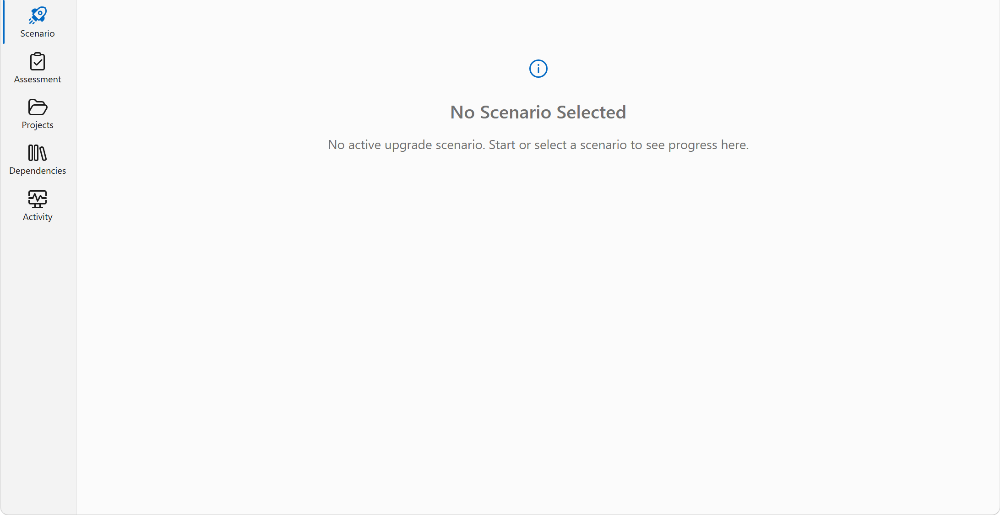
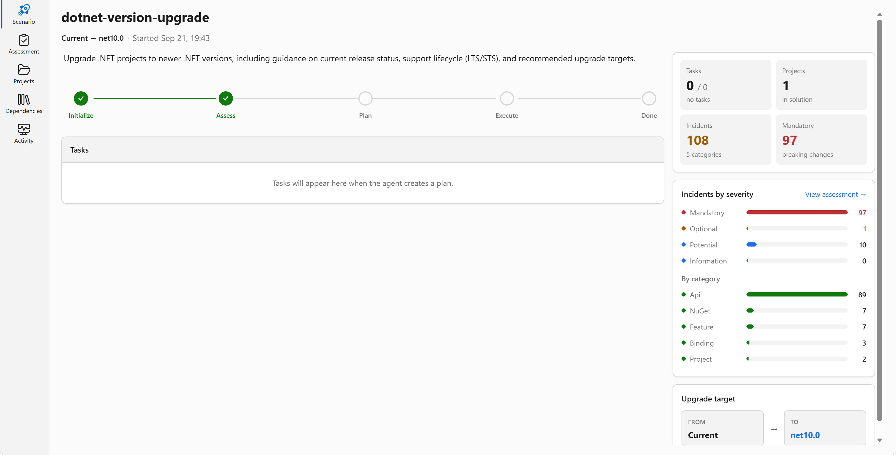
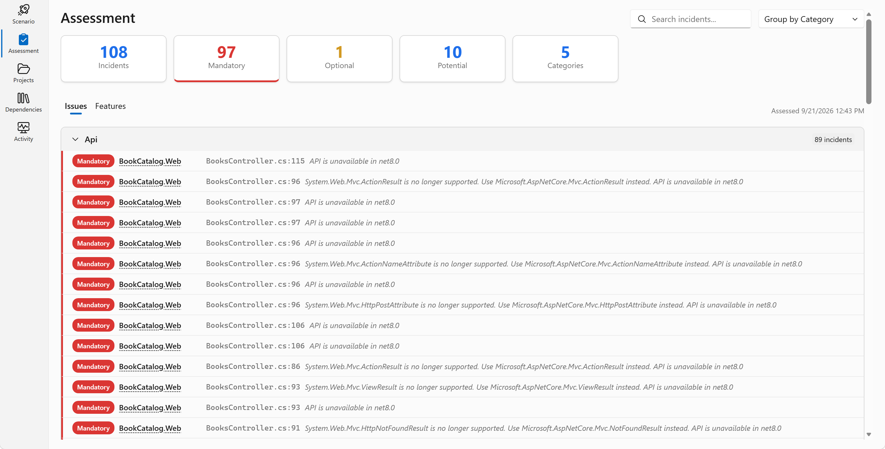
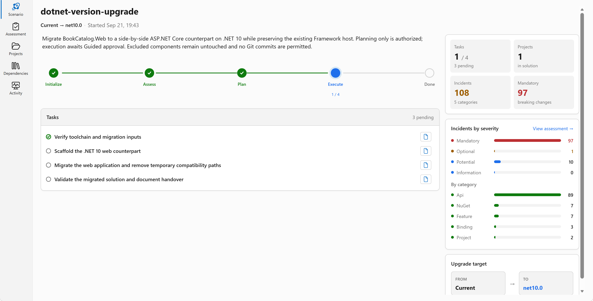

<a id="bookcatalog-visual-studio-recording"></a>
# BookCatalog: a previous sample run

<!-- repo-only:start -->
> [!TIP]
> **Prefer the web experience?** [Open this page on the course website](https://microsoft.github.io/dotnet-modernization-for-beginners/#/reference?path=examples%2Fassessments%2Fbookcatalog%2FREADME.md) for the best reading experience and navigation.
<!-- repo-only:end -->

This page shows BookCatalog work done before the course: a legacy-app launch and a later assessment, plan, and upgrade attempt.
Use it to see example output, not as a set of steps to copy.

The launch was observed on September 18, 2026.
The September 21 sample run supplied the assessment, planning, and execution artifacts below.
Those later artifacts show an assessment and plan, not a completed upgrade.

<a id="recording-environment"></a>
## Sample run environment

This environment table belongs to the September 18 sample run only.
The later run is described separately below.

| Item | Value used |
| --- | --- |
| Date | September 18, 2026 |
| Sample source | `8a03066708b478c700fcfdf60119a1de46cae56b` |
| Visual Studio | Professional 2026 Insiders, `18.11.12210.170` |
| GitHub Copilot extension | `18.11.979.32481` |
| Modernization upgrade extension | `1.1.458.59476` |
| .NET SDKs | `9.0.318` and `10.0.401` installed |
| SQL Server LocalDB | `17.0.4025.3` |
| Target solution | `shared-legacy-app\BookCatalog.sln` in a separate tracked-source copy |

Extension versions came from the installed VSIX manifests.
Insiders was used for this sample run. You don't need to install preview software for the course.
The run used a dedicated LocalDB instance, separate MDF paths, and an unused local port.
Those run-specific settings aren't learner prerequisites.

The original checkout, its README edits, and its database weren't used as the upgrade target.
No resources were created in Azure. Nothing was committed, pushed, or published.

## Original application

Visual Studio launched the isolated solution through F5.
The browser showed six active seed books in title order, with the MVC 5, EF6, and .NET Framework 4.8 footer.


The **Add New Book** form started with **Active** cleared.
After explicit approval, an active sample book named `Soundcheck field notes` was saved.
It appeared in the list with details and edit links for assigned ID `8`.
That ID belongs to this run, not a learner requirement.

The image is an unmodified browser-page capture of the fresh catalog, before the addition.
It contains sample data only, with no browser chrome, account details, or filesystem paths.

## Modernize entry point

The following is a verbatim excerpt from the Visual Studio Copilot Chat response to `@modernize`:

```text
How can I help with this solution?
I can assess and run an upgrade workflow (for example .NET version upgrade, SDK-style conversion, or package upgrades), or handle a specific coding task.
```

The visible follow-up choices were:

```text
@Modernize Run a .NET version upgrade assessment
@Modernize Convert the project to SDK-style
```

This establishes that the installed entry point responded. It doesn't establish a completed framework assessment.
The response displayed `GPT-5.3-Codex`. That isn't a required model for the course.

## Capture status

These are the September 18 capture limits. They haven't been rewritten to include evidence supplied on a later date.

| Stage | Actual evidence |
| --- | --- |
| Legacy launch | Observed in Visual Studio and the browser |
| New active book | Saved through the isolated application's form and visible in the list |
| Modernize entry | Actual chat response and upgrade-assessment choices |
| Framework assessment and preference edit | Not captured |
| Upgrade options and edited plan | Not captured |
| Agent-generated upgrade and app launch | Not captured |
| Resume of an existing upgrade scenario | Not captured |
| Azure assessment and edited migration plan | Not captured |

Computer Use intermittently exposed an incomplete Visual Studio accessibility tree.
Several actions reported dispatch without an observable change, or failed with `no_viable_candidate`.
The successful launch and chat response remain valid observations. They don't turn the unperformed stages into passing checks.

The tool chapters use the [official upgrade workflow](https://learn.microsoft.com/dotnet/core/porting/github-copilot-upgrade/how-to-upgrade-with-github-copilot?pivots=visualstudio)
and [Visual Studio Azure workflow](https://learn.microsoft.com/dotnet/azure/migration/appmod/quickstart?pivots=visualstudio) for the remaining procedures.
Their prompts are course instructions, not responses from this sample run.

## September 21 supplied assessment and upgrade

The supplied notes contain a real BookCatalog assessment, an initial plan, later task records, and six dashboard screenshots.
The user reports that the upgrade was still running after more than five hours, with database safety causing difficulty.
That's a user-reported duration, not a measured course completion time.
The records show database admission blockers, but they don't establish how much of that time those blockers caused.

The later snapshot is named `final-mod-agent-files`, but final validation is still in progress.
Its scenario metadata starts at `2026-09-21T19:43:37Z` and was last updated at `2026-09-22T00:16:07Z`.
Those timestamps don't establish the duration of every interaction.
No new Visual Studio session or database check was run to prepare this evidence page.

### What the assessment actually found

The [assessment excerpts](assessment-excerpts.md) preserve the report's counts and the later package reconciliation.

| Finding | What the supplied evidence says |
| --- | --- |
| Scope | One non-SDK-style `BookCatalog.Web.csproj`, targeting `net48`, with no project dependencies |
| Target | `net10.0` in the saved Markdown and JSON |
| Size | 14 code files, 636 lines of code, and seven files with incidents |
| API findings | 83 binary-incompatible and six source-incompatible findings, all grouped under `System.Web` |
| Other findings | Seven package, three binding, two project, and seven feature incidents in the structured report |
| Total | 108 incidents. This isn't a count of distinct manual edits |
| Package discrepancy | Markdown reports zero aggregate NuGet packages, but readiness records reconcile six packages and seven findings |

The later readiness task checked actual assembly identities.
It reports that Newtonsoft.Json package `13.0.3` contains assembly `13.0.0.0`, matching the existing redirect.
So the reported redirect conflict wasn't reproduced in the baseline rebuild.
An assessment gives you findings to review, not a list to apply without checking.
Editing the assessment is optional.

The supplied notes report the entry choice **@Modernize Run an assessment for BookCatalog** and an automatically opened assessment.
That wording differs from the September 18 greeting above. Neither label is presented as universal across tool versions.

### What the plan selected

The [planning excerpts](planning-excerpts.md) preserve the original options and a later change.
The first plan selected All-at-Once ordering, a side-by-side project, System.Web Adapters, EF6, inline API fixes, and disabled nullable reference types.
It required review of binding redirects before removal.

The plan proposed `src\BookCatalog.Web.Core\BookCatalog.Web.Core.csproj` while retaining the Framework host.
It started with four tasks: readiness, scaffolding, migration, and validation.
Confirming those options authorized planning, not implementation.

The supplied scripts identify the scenario directory relative to the solution root:

```text
.github\upgrades\scenarios\dotnet-version-upgrade\
```

The supplied notes identify the generated assessment and planning files there:

```text
assessment.md
assessment.json
assessment.csv
scenario-instructions.md
plan.md
tasks.md
```

Later task files use `tasks\<task-id>\task.md` and `progress-details.md`.
The later snapshot also includes `runtime-acceptance.md`.
The notes preserve the post-plan instructions under the misspelled capture name `scenario-intructions-after-plan.md`.
That capture name isn't the generated filename.

### Where execution changed direction

The task records describe these changes after the first plan:

1. The agent disabled legacy startup schema creation and seeding for the shared-database approach.
2. The configured LocalDB identity failed the plan's restricted-runtime requirement because it had `sysadmin` privileges.
3. Read-only SQL Express discovery didn't establish an isolated target with a suitable runtime identity.
4. The user authorized database-independent scaffolding, then code migration, before database admission.
5. The agent added health and CSS probes while keeping book routes blocked with HTTP 503.
6. The user changed Guided execution to Automatic execution and later accepted a fresh disposable Docker fixture.
7. Fixture admission passed, but the copied task state still leaves final runtime validation open.

The [execution excerpts](execution-excerpts.md) separate successful builds and HTTP probes from pending application checks.
The records also describe scaffold repair after partial tool failure and a successful rebuild after an executable lock.
Those are reported recovery steps, not proof that the full upgrade finished.

### Why the demo now uses one host and fresh data

The recorded side-by-side choice required two hosts to share a schema without damaging existing data.
That brought restore checks, separate schema and runtime identities, disabled initializers, and proxy cleanup into a small demo.
These are reasonable concerns when old and new production applications coexist.
They don't match this course's approved disposable-data goal.

The revised course instead requests an in-place ASP.NET Core MVC upgrade to .NET 10 with EF Core.
EF Core creates and seeds a separate demo database. The course doesn't require the old records to survive.
The original database stays outside that work.
This is a teaching decision informed by the run, not evidence that an in-place upgrade has already passed.

### Dashboard sequence

These screenshots show workflow state, not the upgraded application running.
All six were cropped for privacy as documented below.
Some assessment labels mention .NET 8 despite the saved `net10.0` target. The pixels haven't been corrected.

**Entry point.** The dashboard has no active scenario yet.



**Assessment ready.** The scenario links to the assessment while planning and execution remain incomplete.



**Detailed findings.** The assessment view groups incidents by category, with the 89 API findings expanded.



**Plan ready.** The dashboard shows the four planned tasks before execution.


**Readiness complete.** One task has finished. The upgrade isn't complete.



**Later execution.** Most task entries are complete, but final validation remains open.


### What remains unproven

| Evidence level | Supported claim | Limit |
| --- | --- | --- |
| Supplied assessment and plan | Findings, selected options, generated tasks, and later recorded decisions | Not successful execution |
| Build logs | Successful baseline and mixed-solution builds, including the later retry | Not a Visual Studio F5 launch |
| HTTP logs and responses | Health, stylesheet proxying, native CSS, and blocked-route checks | Not book creation, editing, or restart persistence |
| Fixture admission log | Reported synthetic-data restore, schema inspection, and restricted runtime permissions | Not preservation of original records |
| Runtime acceptance document | Required checks and explicit pending status | Not passed runtime acceptance |
| Final task scripts | Intended parity, persistence, and final-build checks | Their final result logs aren't supplied |
| September 18 observation | Legacy Visual Studio launch and a saved sample book | Not the later generated app |

The final snapshot reports 10 of 11 tasks complete and task 04 in progress.
Earlier blocked narratives remain alongside later superseding fixture-admission entries.
We haven't treated those older paragraphs as the latest state or inferred missing results from script files.
Generated-app launch, saved-edit persistence after restart, final adapter cleanup, and Azure assessment or planning remain unverified here.

## Provenance and excerpt boundaries

The raw sample-run copy is retained in the implementation session's private artifact directory as `bookcatalog-vs-walkthrough`.
The private `walkthrough-evidence.md` records its environment and observations.

| Public item | Original source | Treatment |
| --- | --- | --- |
| `images/legacy-preview.png` | Browser capture of the isolated app at its loopback root URL | Full application page. No crop or text changes |
| Modernize excerpt | Visual Studio Copilot Chat, `@modernize` thread | Greeting paragraph and two follow-up labels only. No rewritten tool text |
| Observation prose | Maintainer interpretation of UI and browser observations | Explanation, not verbatim tool output |

No framework or Azure scenario artifact path was captured in the September 18 sample run.
The later framework paths above come from the supplied notes and scripts, not that run.

The September 21 review covered all 151 files in the supplied `mod-course-notes` folder, including `final-mod-agent-files`.
It included the notes attachment, both assessment snapshots, plans, preferences, task narratives, scripts, logs, HTTP responses, and all six screenshots.
Repeated text and response bodies were compared by content. Large build logs were inspected for outcomes and diagnostics.
No supplied script was executed.

| New public item | Supplied source | Treatment |
| --- | --- | --- |
| `assessment-excerpts.md` | `assessment.md` and readiness task progress | Selected verbatim blocks with separate interpretation |
| `planning-excerpts.md` | Original and later `plan.md` | Selected verbatim blocks with separate interpretation |
| `execution-excerpts.md` | Build, HTTP, fixture-admission, task-state, and runtime-acceptance files | Selected verbatim blocks. Private-path lines omitted, not rewritten |
| Six `images/ch*.png` files shown above | Same-named screenshots in the supplied notes | Privacy crops only. No labels, counts, or statuses changed |

The screenshot review checked browser accounts, usernames, private paths, connection details, and secrets.
Each crop removes the top 264 source pixels, including browser chrome, the account avatar, and the workspace-path header.
Each also removes eight pixels from the bottom, left, and right edges to exclude adjacent-window slivers.
The crop starts at source coordinate `(8, 264)`.
The first source is 2200 × 1398 pixels, producing 2184 × 1126 pixels.
The other five are 3024 × 1802 pixels, producing 3008 × 1530 pixels.
The PNGs were re-encoded from those rectangles without copying source metadata. They weren't resized or relabeled.

Raw build logs contain user paths. Some HTTP headers also contain encoded source paths.
Those files, raw scripts, configuration, database assets, and credential locations aren't public excerpts.
No raw folder was copied into the repository.

Raw scenarios, local database files, and session paths aren't included in the site or sample ZIP.

**[Back to assessment](../../../04-assessment/README.md)** · **[Maintainer evidence](../../../docs/validation.md)**
