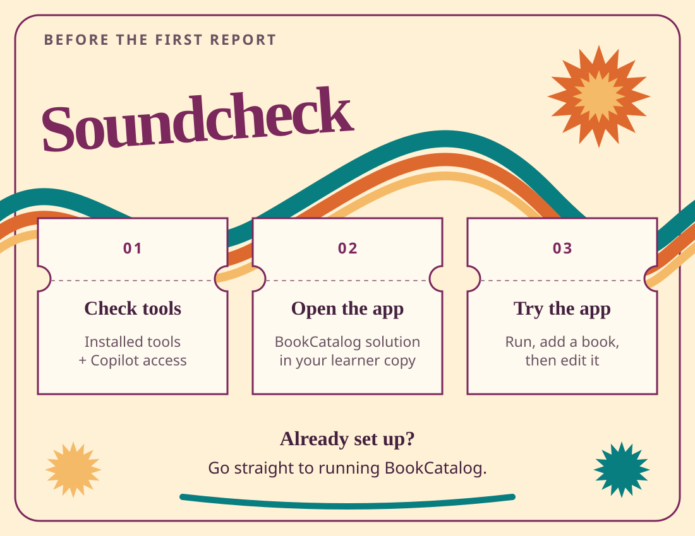

# Chapter 03: Get ready

Let's run BookCatalog before we ask the modernization agent to upgrade it. You'll check your tools, download the course, and try the app.

**[Already set up? Run BookCatalog](#run-bookcatalog)**



## Check before installing

Use **Windows, Visual Studio 2026, and PowerShell**. Visual Studio Insiders also works, but isn't required.

### Check Visual Studio in the installer

1. Open **Visual Studio Installer** from the Windows Start menu.
2. Find your Visual Studio 2026 installation.
3. Select **Modify**.
4. On **Workloads**, select **ASP.NET and web development**.
5. On **Individual components**, check the components below.
6. Select **Modify** to install any missing components.

| Component | Why you need it |
| --- | --- |
| .NET Framework 4.8 SDK and targeting pack | Build the original BookCatalog project |
| IIS Express | Run the original web app from Visual Studio |
| SQL Server Express LocalDB | Run the demo database on your computer |
| .NET SDK 10 or later, plus the .NET 10 runtime | Build the app with a supported SDK and run its .NET 10 target |
| GitHub Copilot | Open Copilot Chat |
| GitHub Copilot app modernization | Assess and upgrade the application |

The Copilot components also appear under **.NET desktop development** in the installer.
Search for their names on **Individual components** if you don't see them on the workload page.

For missing components, use the [Visual Studio modification guide](https://learn.microsoft.com/visualstudio/install/modify-visual-studio)
and [modernization installation guide](https://learn.microsoft.com/dotnet/core/porting/github-copilot-upgrade/install?pivots=visualstudio).

### Check the command-line tools

Open **PowerShell** from the Start menu. Run each command below.

```powershell
git --version
dotnet --list-sdks
sqllocaldb info
```

| Command | Result to look for | If it's missing |
| --- | --- | --- |
| `git --version` | A Git version number | Install [Git for Windows](https://git-scm.com/downloads/win), then reopen PowerShell |
| `dotnet --list-sdks` | A stable SDK version of `10.0.100` or later | Install the [.NET 10 SDK](https://dotnet.microsoft.com/download/dotnet/10.0) |
| `sqllocaldb info` | An instance named `MSSQLLocalDB` | Install LocalDB through Visual Studio Installer |

**`10.0.401` is supported.** Later stable .NET 10 SDKs and later stable major versions are also accepted.
Don't remove a newer SDK or install an older feature band to match an example.
The app still targets .NET 10, so keep the .NET 10 runtime installed even when you build with a newer SDK.

If LocalDB is installed but `MSSQLLocalDB` isn't listed, run:

```powershell
sqllocaldb create MSSQLLocalDB
```

### Check Copilot access

Open Visual Studio. Sign in to the GitHub account that has Copilot access.
Open **GitHub Copilot Chat**. You'll check the `@Modernize` entry point after opening BookCatalog below.

Use the supplied sample code and demo data. Follow your organization's rules for sending source to Copilot.
You don't need Azure CLI, Node, Python, or an Azure subscription for the required course.

## Make your learner copy

Open PowerShell in the directory where you keep your projects. Run these commands:

```powershell
git clone https://github.com/microsoft/dotnet-modernization-for-beginners.git bookcatalog-course
```

After the clone finishes without errors, run:

```powershell
Set-Location bookcatalog-course
git switch -c learn/bookcatalog-upgrade
```

The `bookcatalog-course` directory is your **learner copy**. All lesson paths start there unless a step says otherwise.
The branch keeps your course changes together.

If `bookcatalog-course` already exists, open that directory instead of cloning over it.
Run `git status --short` to see existing changes. Continue on your existing course branch if you've already created one.

From `bookcatalog-course`, check which SDK the sample selects:

```powershell
Push-Location shared-legacy-app
dotnet --version
Pop-Location
```

Expect a stable version of `10.0.100` or later, such as `10.0.401`.
The sample's `global.json` accepts later stable SDKs, including later major versions.
If the command reports no compatible SDK, run `dotnet --list-sdks` and install a stable .NET 10 or later SDK.

## Run BookCatalog

1. In Visual Studio, select **File > Open > Project/Solution**.
2. Open `shared-legacy-app\BookCatalog.sln` inside your learner copy.
3. In **Solution Explorer**, right-click the solution and select **Restore NuGet Packages**.
4. Select **Build > Rebuild Solution**.
5. Wait for the **Output** window to report a successful build.
6. Select **IIS Express** beside the green start button.
7. Press F5.

BookCatalog opens in your browser. A new demo database shows six active books in title order.
The sample also has one inactive book, which doesn't appear in the list.
Entity Framework creates and seeds the demo database. You don't need to create its files yourself.

<details>
<summary>If the app doesn't start</summary>

In Visual Studio, select **View > Output**, then choose **Build** from the output list.
Read the first error. Use **View > Error List** to find its file and line.

- For missing packages, run **Restore NuGet Packages** again.
- For missing framework or web tools, add the component named in the error through Visual Studio Installer.
- For a LocalDB connection error, run `sqllocaldb info MSSQLLocalDB` in PowerShell.
- If that instance is stopped, run `sqllocaldb start MSSQLLocalDB` and launch the app again.
- For a port conflict, open the web project's **Properties > Web** page and choose an unused local port.

The supplied connection is in `shared-legacy-app\src\BookCatalog.Web\Web.config`.
It uses `(LocalDB)\MSSQLLocalDB` and an MDF file under the app's `App_Data` directory.

</details>

## Try the catalog

1. Open a book's **View** link.
2. Return to the list.
3. Select **Add New Book**.
4. Enter a sample title and author.
5. Select **Active**.
6. Save the book.
7. Open the new book's **Edit** link.
8. Change its title and save.
9. Check that the list shows the changed title.

ISBN and Published Year are optional. **Active** starts cleared.
Select it so your book appears in the list.

This is demo data. The upgrade will create the database schema and seed books with EF Core.
You don't need to carry the books you added here into the upgraded app.

Return to Visual Studio and select **Debug > Stop Debugging**.
Open **GitHub Copilot Chat** and send `@Modernize`.
Expect an upgrade assessment choice and the **Upgrade Agent Dashboard**.
If the command isn't available, check the installed modernization component and your Copilot sign-in.

Continue when BookCatalog runs and `@Modernize` responds.

**[Next: assess BookCatalog](../01-assessment/README.md)** · **[Back: meet the app](../00-introduction/README.md)**
